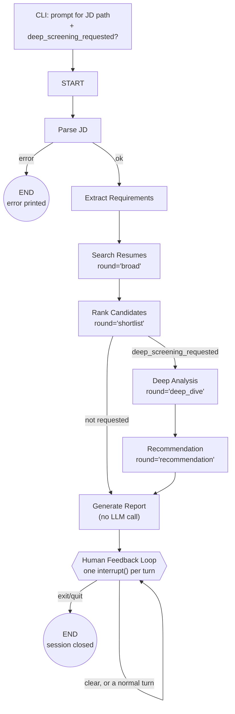

# Agent Architecture

A step-by-step technical reference for `matching_agent.py`'s `StateGraph`:
its state schema, checkpointing behavior, every node and edge, and every
tool. Where `DESIGN.md` records *why* each choice was made, this document
describes *what actually runs*, in execution order. See `DESIGN.md` for
rationale and `TEST_SCENARIOS.md` for worked example conversations.

## 1. Overview

One `StateGraph`, one checkpointer, one thread per screening session. It
runs two different ways depending on where execution is:

- **`Parse JD` → `Generate Report`** (plus the two conditional Phase 3
  nodes): a fixed, deterministic pipeline. No LLM decides control flow here
  — every edge is either unconditional or a plain state-flag check.
- **`Human Feedback Loop`**: a single node, re-entered via a self-loop edge,
  that hands each conversational turn to a stateless tool-calling helper
  (`create_agent(model, tools=TOOLS)`). This is the only place an LLM
  chooses what happens next, and the only place a human is in the loop.

Everything the graph does — pipeline stages and every chat turn alike — is
persisted under one `AgentState`, by one checkpointer, on one thread.
There is no second, independently-checkpointed graph anywhere in this
design.

## 2. State — `AgentState`

A single `TypedDict` (well, a LangGraph state schema — implemented as a
`TypedDict` or `pydantic` model, whichever `matching_agent.py` chooses)
threaded through every node. Grouped by concern:

**Session & I/O**

| Field | Type | Set by |
|---|---|---|
| `thread_id` | `str` | CLI entrypoint |
| `jd_source_path` | `str` | CLI entrypoint (before `START`) |
| `deep_screening_requested` | `bool` | CLI entrypoint (before `START`) |
| `error` | `str \| None` | any node, on failure |

**JD & requirements**

| Field | Type | Set by |
|---|---|---|
| `jd_text` | `str` | `Parse JD` |
| `jd_sections` | `dict[str, str]` | `Extract Requirements` |
| `must_haves` | `list[str]` | `Extract Requirements` |
| `nice_to_haves` | `list[str]` | `Extract Requirements` |

**Retrieval & ranking**

| Field | Type | Set by |
|---|---|---|
| `candidate_pool` | `list[dict]` | `Search Resumes` |
| `match_results` | `list[MatchResult]` | `Rank Candidates` |
| `round` | `Literal["broad","shortlist","deep_dive","recommendation"]` | whichever node last wrote `match_results` / ran an escalation stage |

**Multi-round screening (Phase 3, only populated when `deep_screening_requested`)**

| Field | Type | Set by |
|---|---|---|
| `deep_analysis` | `list[DeepAnalysisResult]` | `Deep Analysis` |
| `recommendations` | `list[Recommendation]` | `Recommendation` |

**Conversation (Phase 2)**

| Field | Type | Set by |
|---|---|---|
| `report` | `str` | `Generate Report` (also the seed message for the first chat turn) |
| `messages` | `Annotated[list[AnyMessage], add_messages]` | `Human Feedback Loop`, every turn |
| `session_ended` | `bool` | `Human Feedback Loop`, on `exit`/`quit` |

### Checkpointing

The checkpointer is `InMemorySaver` (same as `llm_file_assistant`), bound
once at graph-compile time, keyed by `thread_id`. In LangGraph terms, a
"checkpoint" is an automatic snapshot of the entire `AgentState` taken after
every node finishes — this happens for **every** node (`Parse JD`,
`Extract Requirements`, ... `Human Feedback Loop`), not just the
interactive one. Most of these checkpoints are invisible in normal
operation; they only matter if a run crashes mid-pipeline (the graph could
in principle resume from the last completed node on the same thread,
though nothing in this design relies on that).

There is exactly **one place execution actually pauses for external
input**: inside `Human Feedback Loop`, via `interrupt()` (see §5). Every
other transition in the pipeline runs straight through, node to node, with
no human involved. `deep_screening_requested` and `jd_source_path` are
*not* checkpoints or interrupts — they're plain Python `input()` prompts
the CLI collects **before** `graph.invoke()` is ever called, then passed in
as the initial state.

## 3. Nodes, in execution order

### `Parse JD`
- **Reads:** `jd_source_path` (from initial state).
- **Calls:** `fs_tools.read_file(jd_source_path)` — sandboxed to
  `ROOT_DIR = ../rag_profile_match/root_dir`.
- **Writes (success):** `jd_text`.
- **Writes (failure):** `error` — path outside the sandbox, or the file
  doesn't exist. No LLM call in this node.

### `Extract Requirements`
- **Reads:** `jd_text`.
- **Calls:** `jd_parser.split_job_sections(jd_text)` (regex on the 4 fixed
  headings: `About the role` / `Responsibilities` / `Must-have
  requirements` / `Nice-to-have`) → `jd_parser.extract_must_have_requirements`
  and `jd_parser.extract_nice_to_have_requirements` (bullet-list parsing on
  the relevant section).
- **Writes:** `jd_sections`, `must_haves`, `nice_to_haves`. No LLM call —
  purely algorithmic.

### `Search Resumes`
- **Reads:** `jd_sections` (only `header` + `about_the_role` +
  `responsibilities` — must-haves are deliberately *not* embedded here).
- **Calls:** `retrieval.embed_job_description(...)` (dense vector via
  OpenRouter's `openai/text-embedding-3-small`, sparse vector via
  fastembed's `Qdrant/bm25`) → `retrieval.semantic_search(...)` (Qdrant
  `query_points` hybrid search, RRF-fused, pool size
  `max(top_k * 3, 15)`, grouped by resume keeping each candidate's best
  score + up to 2 excerpts).
- **Writes:** `candidate_pool`, `round = "broad"`.

### `Rank Candidates`
- **Reads:** `candidate_pool`, `must_haves`, `nice_to_haves`.
- **Calls:** `ranking.keyword_match_score(...)` per candidate against
  `must_haves` (hard filter, no partial credit) → `ranking.score_and_rank(...)`
  (min-max normalizes survivors' RRF scores to 0–100) → the same
  `keyword_match_score` again against `nice_to_haves`, informational only
  (doesn't gate or affect `match_score`).
- **Writes:** `match_results` (`list[MatchResult]`), `round = "shortlist"`.
- **Conditional edge after this node:** `deep_screening_requested` → `Deep
  Analysis`; otherwise → `Generate Report` directly.

### `Deep Analysis` *(Phase 3 — only if `deep_screening_requested`)*
- **Reads:** `match_results`, `must_haves`, `nice_to_haves`.
- **Calls, per candidate:** `fs_tools.read_file(resume_path)` for the
  *full* resume text (not just `MatchResult.relevant_excerpts`'s 1–2
  chunks) → one structured-output LLM call
  (`.with_structured_output(DeepAnalysisResult)`, batched via `.batch()`
  with `return_exceptions=True`, mirroring
  `resume_rag.extract_fields_batch`'s pattern).
- **`DeepAnalysisResult` fields:** `candidate_name`, `resume_path`,
  `strengths: list[str]`, `gaps: list[str]`,
  `nice_to_have_coverage: list[str]`, `must_have_discrepancy: str | None`
  (set only when the full-resume read contradicts the original
  chunk-based must-have check).
- **Writes:** `deep_analysis`, `round = "deep_dive"`.

### `Recommendation` *(Phase 3 — only if `deep_screening_requested`)*
- **Reads:** `match_results`, `deep_analysis`.
- **Calls:** a deterministic verdict function (no LLM), then one
  structured-output LLM call per candidate for justification prose.
- **Verdict thresholds** (deterministic — the LLM never decides the label):

  | Verdict | Rule |
  |---|---|
  | Strong Hire | `match_score ≥ 80` and no `must_have_discrepancy` |
  | Hire | `match_score` 60–79 and no `must_have_discrepancy` |
  | Borderline | `match_score` 40–59, or 60+ with a `must_have_discrepancy` |
  | No Hire | `match_score < 40`, or an already-Borderline candidate with a `must_have_discrepancy` |

- **`Recommendation` fields:** `candidate_name`, `resume_path`, `verdict`,
  `justification` (LLM-authored, grounded in `deep_analysis`),
  `improvement_suggestions: list[str]` (populated only when `verdict ==
  "Borderline"` — same LLM call, no second one).
- **Writes:** `recommendations`, `round = "recommendation"`.

### `Generate Report`
- **Reads:** `match_results`; if present, `deep_analysis` and
  `recommendations`.
- **Calls:** a deterministic `rich`-rendered table — **no LLM call, ever**,
  regardless of `deep_screening_requested`. Every word rendered comes from
  already-computed structured fields.
- **Writes:** `report`. Reaches `END` directly if `Human Feedback Loop`
  isn't reached (it always is, in this design — see §4).

### `Human Feedback Loop`
One node, re-entered via a self-loop edge — **one execution per
conversational turn**, never a Python loop spanning multiple turns inside
one execution (see §5 for why). On the very first entry, `state["messages"]`
is seeded with `state["report"]` so the human's first turn already has the
shortlist in context.

Per turn:
1. `interrupt()` — the only one in this node, called first — blocks until
   `Command(resume=<user text>)` arrives from the CLI.
2. `exit`/`quit` → set `session_ended = True`, return immediately (no tool
   calls). `clear` → wipe `messages`
   (`RemoveMessage(REMOVE_ALL_MESSAGES)`), leave every other field
   untouched, return without invoking the helper either.
3. Otherwise: copy `match_results`, `must_haves`, `nice_to_haves`,
   `jd_text`, `jd_sections`, `candidate_pool` into `tools.py`'s shared
   mutable session container.
4. Invoke `create_agent(model, tools=TOOLS)` — built fresh, **no
   checkpointer of its own** — with
   `{"messages": state["messages"] + [HumanMessage(user_text)]}`. It runs
   its own internal loop (model call → any tool calls → model call again →
   ... until no more tool calls), calling into whichever of the tools in
   §6 it decides to use.
5. Read the (possibly tool-mutated) session container back out.
6. Return the state update: this turn's new messages appended, plus
   `match_results`/`must_haves`/`nice_to_haves`/`jd_text`/`jd_sections`/
   `candidate_pool` set to whatever the session container now holds.
7. Conditional edge: `session_ended` → `END`; else → `Human Feedback Loop`
   again.

## 4. Edges / control flow

| From | To | Condition |
|---|---|---|
| `START` | `Parse JD` | unconditional |
| `Parse JD` | `END` | `error` is set |
| `Parse JD` | `Extract Requirements` | no error |
| `Extract Requirements` | `Search Resumes` | unconditional |
| `Search Resumes` | `Rank Candidates` | unconditional |
| `Rank Candidates` | `Deep Analysis` | `deep_screening_requested == True` |
| `Rank Candidates` | `Generate Report` | `deep_screening_requested == False` |
| `Deep Analysis` | `Recommendation` | unconditional |
| `Recommendation` | `Generate Report` | unconditional |
| `Generate Report` | `Human Feedback Loop` | unconditional |
| `Human Feedback Loop` | `END` | `session_ended == True` (human typed `exit`/`quit`) |
| `Human Feedback Loop` | `Human Feedback Loop` | `session_ended == False` (self-loop, next turn) |

## 5. Checkpointing & interrupts, in detail

- **Not a checkpoint:** `jd_source_path` and `deep_screening_requested` are
  collected by the CLI via plain `input()` prompts *before*
  `graph.invoke(initial_state, config)` is ever called. The graph never
  pauses for these — they simply arrive as part of the initial state.
- **Automatic checkpoints:** after every node in the pipeline
  (`Parse JD` through `Generate Report`, and each `Human Feedback Loop`
  turn), `InMemorySaver` snapshots the full `AgentState` under
  `thread_id`. This is LangGraph's default behavior for any compiled graph
  with a checkpointer — it isn't something this design adds deliberately,
  but it's what makes the one real interrupt possible.
- **The one real pause point:** `interrupt()` inside `Human Feedback Loop`.
  Mechanically: calling `interrupt(value)` raises a special exception that
  unwinds the whole graph run back to whoever called `.invoke()`/`.stream()`
  (the CLI), *persisting the checkpoint at that exact point*. The CLI reads
  `value` (a prompt for the next line of chat), collects the human's input,
  and resumes with `graph.invoke(Command(resume=user_text), config)` on the
  same `thread_id`. Because a resumed node **re-executes from the top of
  its function body** (any earlier `interrupt()` calls in the same
  execution just replay their cached value instantly), this design keeps
  to exactly **one** `interrupt()` call per node execution — see
  `DESIGN.md`'s Phase 2 section for the failure mode this avoids (a
  multi-`interrupt()` loop inside one node would silently re-run earlier
  turns' side effects on every resume).
- **What doesn't survive:** `InMemorySaver` is process-local. Closing the
  CLI process loses the entire thread — the full pipeline result and every
  chat turn. There is no cross-session persistence in this design (a
  documented limitation, not an oversight).

## 6. Tools

Two different kinds of "tool" appear in this design — worth keeping
distinct:

- **Node actions** — plain function calls a pipeline node makes directly
  (`fs_tools.read_file`, `retrieval.semantic_search`, `ranking.score_and_rank`,
  etc.). These are never exposed to an LLM as a callable tool; the outer
  graph's control flow is deterministic, not agent-decided.
- **LLM-callable tools** — the `TOOLS` list handed to `create_agent(model,
  tools=TOOLS)` inside `Human Feedback Loop`. Only these can be invoked by
  the model's own tool-calling decisions.

### `TOOLS` (the inner helper's tool belt)

From `fs_tools.py` (unchanged from `llm_file_assistant`):

| Tool | Signature | Purpose |
|---|---|---|
| `list_files` | `(directory=".", extension=None)` | Recursively list sandboxed files, optionally by extension |
| `read_file` | `(filepath)` | Extract full text from `.txt`/`.docx`/`.pdf` |
| `search_in_file` | `(filepath, keyword)` | Case-insensitive keyword search within one file, with context |
| `write_file` | `(filepath, content)` | Create a new file (no overwrite) — how a human-requested report copy gets saved |

From `tools.py` (new, close over the shared session container):

| Tool | Signature | Purpose |
|---|---|---|
| `search_resumes` | `(query: str, must_have_keywords: list[str] = [], min_experience_years: float \| None = None)` | Loose-NL search — embeds `query` (not JD-shaped text), runs hybrid RRF search, applies keyword filtering with whatever structured params the LLM supplied, and **replaces** the session's `match_results`/`candidate_pool`. Doubles as the entire refinement mechanism — every call overwrites the active shortlist. |
| `extract_requirements` | `(jd_text: str)` | For a wholesale new JD pasted mid-conversation — same `jd_parser` functions as the outer graph's `Extract Requirements` node, overwriting `jd_text`/`jd_sections`/`must_haves`/`nice_to_haves` in the session. Typically followed by a `search_resumes` call in the same turn. |
| `compare_candidates` | `(candidate_identifiers: list[str])` | Read-only. Fuzzy-resolves each identifier (name substring or exact `resume_path`) against the *current* `match_results`; returns a side-by-side structured comparison. Unresolvable identifiers come back as a "not found, did you mean X" entry. |
| `generate_interview_questions` | `(candidate_identifier: str)` | Resolves the identifier, re-reads the candidate's *full* resume via `fs_tools.read_file` (not just stored excerpts), then one LLM call drafts questions targeting gaps/must-haves. |
| `deep_analyze_candidates` | `(candidate_identifiers: list[str])` | The same logic as the `Deep Analysis` node, callable on demand for specific candidates rather than the whole shortlist. |
| `generate_recommendation` | `(candidate_identifiers: list[str])` | The same logic as the `Recommendation` node (deterministic verdict + LLM justification + conditional improvement suggestions), callable on demand. |

### The shared session container

`tools.py` holds a module-level mutable object the tools above close over
— it's how a plain `@tool`-decorated function reaches "the current active
shortlist" without being a node of the outer graph itself. `Human Feedback
Loop` copies the relevant `AgentState` fields into it right before invoking
`create_agent(...)`, and copies the (possibly mutated) values back out
afterward. This is a deliberate simplification over LangGraph's
`InjectedState` mechanism, which is built for tools running inside a
`ToolNode` of the *same* graph — the inner helper here is a separate,
stateless object, not a node, so that machinery doesn't apply.

## 7. End-to-end walkthrough (example session)

1. CLI starts. Prompts: *"JD path?"* → `jobs/senior_backend_engineer.txt`.
   *"Run full 3-round screening? [y/N]"* → `N`.
2. `graph.invoke({"jd_source_path": ..., "deep_screening_requested": False,
   "thread_id": "session-1", ...}, config)`.
3. `Parse JD` reads the file → `jd_text` set.
4. `Extract Requirements` parses sections → `must_haves` = `["5+ years of
   hands-on Python development.", ...]`, `nice_to_haves` populated
   similarly.
5. `Search Resumes` embeds the header/about/responsibilities prose, queries
   Qdrant → `candidate_pool` (grouped RRF hits, ~15+ candidates before
   filtering).
6. `Rank Candidates` filters by `must_haves`, normalizes scores →
   `match_results` — e.g. Alice Chen and Wei Zhang at 100.0, a few
   partial-skill candidates trailing behind.
7. `deep_screening_requested` is `False` → straight to `Generate Report`:
   prints the plain ranked table. `report` is set.
8. `Human Feedback Loop` entered. `messages` seeded with `report`.
   `interrupt()` blocks; CLI prints the table and waits for input.
9. Human types: *"Why did Alice rank higher than the others?"* → CLI calls
   `graph.invoke(Command(resume="Why did Alice rank higher..."), config)`.
10. Node resumes: not `exit`/`quit`/`clear` → session container synced →
    `create_agent(...)` invoked with the accumulated messages → it calls
    `compare_candidates(["Alice Chen", ...])` → gets back scores/reasoning
    → replies with an explanation → node appends the new messages, returns.
11. Conditional edge: `session_ended` still `False` → back to
    `Human Feedback Loop`. `interrupt()` blocks again for the next turn.
12. Human types: *"exit"* → node sets `session_ended = True`, returns
    immediately (no tool call this turn).
13. Conditional edge: `session_ended == True` → `END`. CLI exits.
