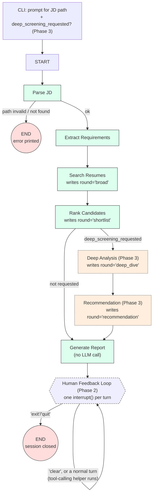
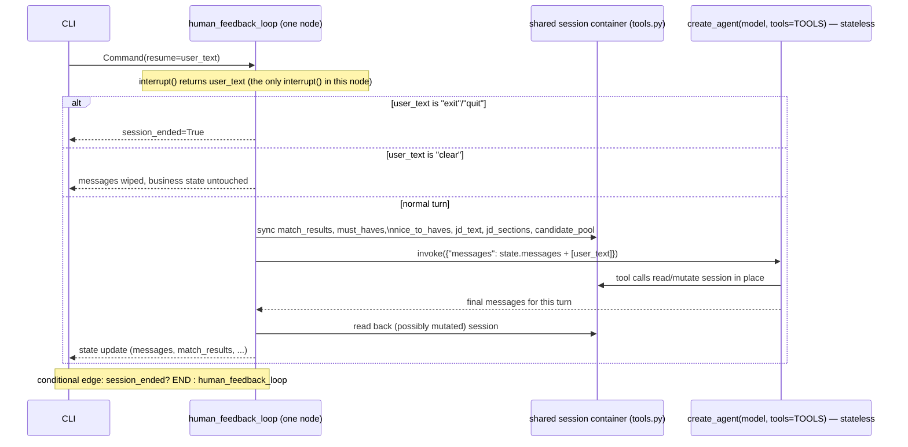

# Design

`agentic_profile_match` wraps `llm_file_assistant`'s sandboxed filesystem
pattern and `rag_profile_match`'s hybrid RAG retrieval into a single
conversational, multi-round resume-screening agent. It reuses both sibling
projects' *data and logic* (duplicated, not cross-imported — see
[Reuse strategy](#reuse-strategy)) rather than re-solving either problem.

This document is the full architecture (Part A deliverable): the complete
`AgentState` schema and the target graph shape, phase-annotated so it's clear
what Phase 1 actually builds versus what later phases add on top of the same
shape. **Phase 1**, **Phase 2**, **Phase 3**, and **Phase 4** are all now
designed *and* implemented — see each phase's section below, and
[File map](#file-map) for the Phase 4 folder reorganization.

## Architecture shape: hybrid graph

Two execution models compose, not one:

1. An outer **`StateGraph`** runs the fixed, deterministic screening pipeline
   — auditable, no LLM deciding control flow, matches how `rag_profile_match`
   itself is built (pure functions, `job_matcher`/`metrics` have no agent).
2. Reaching the `Human Feedback Loop` node runs, **once per conversational
   turn**, a stateless tool-calling helper (`create_agent(model,
   tools=TOOLS)`, no checkpointer of its own) for Part B's free-form turns
   ("compare the top 3", "why did John rank higher") — genuinely open-ended
   NL that a fixed graph can't route without hand-written intent
   classification for every phrasing. It is *not* a second, independently
   persisted graph — see [Phase 2](#phase-2--interactivity) for why.

See [State Machine Diagram](#state-machine-diagram) for the full,
consolidated node/edge graph across all phases.

Solid-boundary nodes (`Parse JD` → `Generate Report`) are **Phase 1**: a
single, non-interactive pass that, by default, prints a report and exits
(`END` reached directly, no feedback loop yet). `Human Feedback Loop` is
Phase 2 — a single graph node re-entered via a self-loop edge, not a
hand-off to a separate node or graph. `Deep Analysis`/`Recommendation` are
Phase 3 — two extra nodes, skipped unless the CLI's upfront prompt opted
into full 3-round screening (see [Phase 3](#phase-3--multi-round-screening)).

## State Machine Diagram

The Guidelines' "state machine diagram (visual representation)" deliverable
(Q4, Phase 4) — one definitive graph, all phases, superseding the
incremental per-phase sketches used while designing:

Two distinct `END`s are worth calling out explicitly since they're easy to
conflate: `Parse JD`'s error path (bad/missing JD file — a same-turn,
no-conversation exit) versus `Human Feedback Loop`'s `exit`/`quit` path (a
graceful close after however many conversational turns). Once
`matching_agent.py` exists, regenerating this from the real compiled graph
(`graph.get_graph().draw_mermaid()`) is a good way to check the
implementation actually matches this design.

## `AgentState` schema (full, all phases)

| Field | Type | Written by | Phase | Purpose |
|---|---|---|---|---|
| `thread_id` | `str` | CLI entrypoint | 1 | LangGraph checkpointer thread key (one per screening session) |
| `jd_source_path` | `str` | `Parse JD` | 1 | Sandboxed path the JD was read from (Q6: free path input, not a picklist) |
| `jd_text` | `str` | `Parse JD` | 1 | Raw job description text |
| `jd_sections` | `dict[str, str]` | `Extract Requirements` | 1 | `header`/`about_the_role`/`responsibilities`/`must_have_requirements`/`nice_to_have` |
| `must_haves` | `list[str]` | `Extract Requirements` | 1 | Hard-filter bullets |
| `nice_to_haves` | `list[str]` | `Extract Requirements` | 1 | Informational only in Phase 1 (see [Known limitations](#known-limitations--backlog)) |
| `candidate_pool` | `list[dict]` | `Search Resumes` | 1 | Raw RRF hits grouped by resume, pre-filter |
| `match_results` | `list[MatchResult]` | `Rank Candidates` | 1 | Final ranked, must-have-filtered candidates |
| `report` | `str` | `Generate Report` | 1 | Rendered CLI report text (kept in state so Phase 2's conversational agent can reference it as context) |
| `messages` | `Annotated[list[AnyMessage], add_messages]` | `Human Feedback Loop` | 2 | Full conversational record — every human turn, tool call, tool result, and reply. The single source of truth for chat history; no separate log field duplicates it (see Phase 2's [Known limitations](#known-limitations--backlog-1)) |
| `session_ended` | `bool` (default `False`) | `Human Feedback Loop` | 2 | Set when the human types `exit`/`quit`; read by the outer conditional edge to route to `END` instead of looping back |
| `deep_screening_requested` | `bool` | CLI entrypoint | 3 | Collected upfront (alongside `jd_source_path`), before the graph is invoked; the conditional edge after `Rank Candidates` reads it — no second `interrupt()` |
| `round` | `Literal["broad","shortlist","deep_dive","recommendation"]` | outer graph | 3 | Which stage produced the current `match_results` — `"broad"`/`"shortlist"` map to `Search Resumes`/`Rank Candidates`, `"deep_dive"`/`"recommendation"` to the two new Phase 3 nodes |
| `deep_analysis` | `list[DeepAnalysisResult]` | `Deep Analysis` | 3 | Per-candidate strengths/gaps/nice-to-have-coverage, grounded in the *full* resume text |
| `recommendations` | `list[Recommendation]` | `Recommendation` | 3 | Per-candidate verdict (deterministic) + LLM-authored justification |
| `error` | `str \| None` | any node | 1 | Set on a recoverable failure (e.g. JD path not found); short-circuits to `END` in Phase 1 |

Deciding this shape fully now (Q2) means Phase 2/3 only *add* nodes that
read/write already-reserved fields — no retrofitting existing Phase 1 node
return types.

## Reuse strategy

`rag_profile_match` isn't installed as an importable dependency of
`agentic_profile_match` (its modules do bare `import config` / `import
fs_tools`, the same cwd-relative pattern `llm_file_assistant` uses — not
package-qualified), so cross-package Python imports between uv workspace
siblings would be fragile. Instead:

- **Code is duplicated** (from both `llm_file_assistant` and
  `rag_profile_match`) — see the module-by-module list below.
- **Data is now independent, not shared** (superseding this section's
  original Phase 1 decision — see the callout right after this list for
  why). `agentic_profile_match` has its own `docker-compose.yml` (a
  different host port, `6350`, so it can run alongside
  `rag_profile_match`'s own Qdrant without conflict) and its own `data/`
  corpus (`data/jobs/`, `data/resumes/<dept>/`), deliberately `.txt`/`.md`
  only. `indexing.py` + `scripts/reindex.py` port over
  `rag_profile_match/resume_rag.py`'s metadata-extraction/chunking/upsert
  pipeline so this project can index its own corpus rather than reading
  someone else's.
- **`fs_tools.py`** is copied over (same sandboxing design as
  `llm_file_assistant`), with `ROOT_DIR` pointed at this project's own
  `data/` (not a sibling project's), and narrowed to `.txt`/`.md` only —
  no `.docx`/`.pdf` support (and no `pypdf`/`python-docx` dependency),
  since the mock corpus is deliberately plain text/markdown.
- **Duplicate only what the graph actually needs as separate, node-callable
  pieces** (Q4: `Search Resumes` and `Rank Candidates` are two real nodes,
  not one call to `job_matcher.match_job()`):
  - `jd_parser.py` — `split_job_sections`, `extract_must_have_requirements`
    (copied from `job_matcher.py`), plus a new `extract_nice_to_have_requirements`
    (same bullet-parsing logic, pointed at the `nice_to_have` section).
  - `retrieval.py` — `embed_job_description`, `semantic_search`, and the
    embedding-model builders (`build_embedding_model`,
    `build_sparse_embedding_model`, copied from `resume_rag.py`).
  - `indexing.py` — `split_resume_sections`, `ResumeFields`,
    `extract_fields_batch`, `build_chunks`, `ensure_qdrant_collection`,
    `upsert_chunks` (copied from `resume_rag.py`'s indexing side — added
    once this project needed to index its own corpus rather than read
    someone else's).
  - `ranking.py` — `keyword_match_score`, `score_and_rank`, `MatchResult`
    (copied from `job_matcher.py`).
  - `matching_agent.py` stays graph/state/node wiring only — `AgentState`,
    the `StateGraph` build, and each node function (a thin call into the
    modules above). It imports from the sibling modules the same way
    `llm_file_assistant/main.py` imports from `fs_tools.py`. The CLI
    entrypoint itself lives in `cli/main.py` (Phase 4 reorganization — see
    [File map](#file-map)), not in `matching_agent.py`.

**Update, post-Phase 4: this project now owns its Qdrant instance and
corpus.** The paragraph above (and the original Phase 1 "no
`docker-compose.yml` of its own" decision) reflected an earlier design
choice to read `rag_profile_match`'s shared Qdrant/`root_dir` rather than
reindex. That was reversed on request: a fresh, from-scratch mock corpus
(3 job postings, 12 resumes across engineering/data/marketing, deliberately
`.txt`/`.md` only — real `.docx`/`.pdf` support was never a hard
requirement, just inherited from `llm_file_assistant`) now lives under this
project's own `data/`, indexed into this project's own Qdrant
(`docker-compose.yml`, host port `6350`). Nothing here reads
`rag_profile_match`'s data or Qdrant instance anymore. See
[File map](#file-map) for exactly what that added.

## File map

Reorganized during Phase 4 into topic folders (docs/prompts/cli/scripts),
with the core pipeline/tooling modules staying flat at the package root —
matching the reasoning in [Reuse strategy](#reuse-strategy): these modules
are still run with `agentic_profile_match/` as the working directory /
`sys.path[0]`, via bare cwd-relative imports, the same convention
`llm_file_assistant`/`rag_profile_match` use. `cli/` and `prompts/` are
plain (namespace) packages, not `pip install -e`'d — no `[build-system]`
was added, to avoid diverging from that shared convention.

| File | Responsibility | Phase |
|---|---|---|
| `config.py` | Env vars, model names, this project's own Qdrant client (host port `6350`) | 1 |
| `fs_tools.py` | Sandboxed FS tools; `ROOT_DIR` → this project's own `data/`; `.txt`/`.md` only | 1 |
| `jd_parser.py` | JD section splitting, must-have/nice-to-have bullet extraction (algorithmic) | 1 |
| `retrieval.py` | JD embedding (dense+sparse) + hybrid RRF search against `resume_chunks` | 1 |
| `indexing.py` | Metadata extraction (`ResumeFields`), section-aware chunking, embedding+upsert into Qdrant — this project's own indexing pipeline (added post-Phase 4, see the callout above) | 1 |
| `ranking.py` | Must-have hard filtering, score normalization, `MatchResult` | 1 |
| `matching_agent.py` | `AgentState`, `StateGraph` nodes/edges, checkpointer | 1 (extended in 2, 3) |
| `tools.py` | `search_resumes`, `extract_requirements`, `compare_candidates`, `generate_interview_questions`, `deep_analyze_candidates`, `generate_recommendation` — the inner tool-calling helper's tool belt, plus the shared mutable session container they close over | 2 (+3) |
| `screening.py` | `DeepAnalysisResult`/`Recommendation` schemas, batched full-resume-grounded LLM analysis, deterministic verdict thresholds | 3 |
| `utils.py` | `CustomLogger` (already scaffolded) | 1 |
| `cli/main.py` | The actual CLI entrypoint: upfront JD-path/deep-screening prompts, the interrupt()/`Command(resume=...)` chat loop, message rendering | 1 (extended in 2, 3) |
| `prompts/conversation.py` | `CONVERSATION_SYSTEM_PROMPT` (Human Feedback Loop's tool-calling agent) | 2 |
| `prompts/deep_screening.py` | `DEEP_ANALYSIS_SYSTEM_PROMPT`, `RECOMMENDATION_SYSTEM_PROMPT` | 3 |
| `prompts/interview_questions.py` | `INTERVIEW_QUESTIONS_INSTRUCTIONS` (the static tail of `generate_interview_questions`'s per-call prompt) | 2 |
| `scripts/smoke_test.py` | Mocked plumbing/regression checks (no live API) across all three phases — see [Phase 4](#phase-4--polish) | 4 |
| `scripts/reindex.py` | Runs `indexing.py`'s pipeline against `data/resumes/` into this project's own Qdrant; idempotent (stable point IDs) | 1 |
| `docker-compose.yml` | This project's own Qdrant (`qdrant/qdrant:latest`, host port `6350`) | 1 |
| `data/jobs/`, `data/resumes/<dept>/` | The mock corpus itself: 3 job postings, 12 resumes, `.txt`/`.md` only | 1 |
| `docs/DESIGN.md`, `docs/AGENT_ARCHITECTURE.md`, `docs/TEST_SCENARIOS.md` | This document, the execution-focused reference, and the manual conversation-flow specs | 1-4 |

Not introduced: a `utils/` folder (`utils.py` is one small `CustomLogger`
class — turning it into a package would be pure ceremony).

## Phase 1 — node-by-node spec

### `Parse JD`
- **Input:** a sandboxed file path (Q6: user supplies any path under
  `jobs/`, no picklist), read via `fs_tools.read_file`.
- **Writes:** `jd_text`, `jd_source_path`.
- **Failure path:** path outside the sandbox or not found → `error` is set,
  the node routes straight to `END` and the CLI prints the error. No retry
  loop in Phase 1 — that's conversational territory (Phase 2).

### `Extract Requirements`
- **Input:** `jd_text`.
- **Action:** `jd_parser.split_job_sections` → `jd_sections`;
  `extract_must_have_requirements` → `must_haves`;
  `extract_nice_to_have_requirements` → `nice_to_haves`. Purely algorithmic
  (Q3) — every posting under `rag_profile_match/root_dir/jobs/` already
  follows the same 4-heading format this regex parses correctly.
- **Writes:** `jd_sections`, `must_haves`, `nice_to_haves`.
- **Backlog (Q3):** revisit as an LLM structured-output step (mirroring
  `resume_rag.ResumeFields`) if job postings stop following the fixed
  heading convention.

### `Search Resumes`
- **Input:** `jd_sections` (header + about_the_role + responsibilities —
  must-haves are deliberately excluded from the embedded query text, same
  rationale as `rag_profile_match`: exact requirements are better served by
  keyword filtering than fuzzy similarity).
- **Action:** `retrieval.embed_job_description` → dense+sparse query
  vectors; `retrieval.semantic_search` → RRF-fused hits grouped by resume
  (`max(top_k * 3, 15)` pool size, same over-fetch rationale as
  `job_matcher.match_job` — the must-have filter downstream can shrink the
  pool, so it needs headroom before filtering).
- **Writes:** `candidate_pool`.
- Does **not** consume `must_haves` — kept as a separate, later step.

### `Rank Candidates`
- **Input:** `candidate_pool`, `must_haves`, `nice_to_haves`.
- **Action:** `ranking.keyword_match_score` per candidate against
  `must_haves` (hard filter — any miss excludes the candidate);
  `ranking.score_and_rank` min-max normalizes survivors' RRF scores to
  0–100. Additionally runs the *same* `keyword_match_score` against
  `nice_to_haves` for survivors only, purely for display — this doesn't
  gate or affect `match_score` in Phase 1, it just avoids extracting
  nice-to-haves in the prior node and then never surfacing them anywhere
  (see [Known limitations](#known-limitations--backlog)).
- **Writes:** `match_results` (`MatchResult` list, each carrying which
  nice-to-haves it also happens to satisfy).

### `Generate Report`
- **Input:** `match_results`, `nice_to_haves` overlap, `jd_source_path`.
- **Action:** deterministic `rich`-rendered table (rank, candidate, score,
  matched skills, must-haves satisfied, nice-to-haves present, reasoning,
  best excerpt) — **no LLM call**, matching Q5. Console-only in Phase 1;
  stays manual/on-demand-only permanently (Q3, Phase 4) rather than
  becoming automatic — see [Phase 3](#phase-3--multi-round-screening)'s
  `Generate Report` note.
- **Writes:** `report`. Graph reaches `END`.

### Known limitations / backlog

- **Nice-to-haves are informational only** — extracted and displayed, not
  scored. Whether/how they should influence `match_score` is an explicit
  open question, not decided here.
- **`Extract Requirements` is regex/heading-based**, not LLM-based (Q3). Fine
  while every posting follows the 4-heading convention; revisit with
  structured LLM extraction if that assumption breaks.
- ~~No standalone Qdrant for this project~~ — **reversed post-Phase 4**: this
  project now has its own `docker-compose.yml`/Qdrant instance and its own
  `data/` corpus; see [Reuse strategy](#reuse-strategy)'s update callout.
- **`InMemorySaver` checkpointer** (Q3/round 1) — a session doesn't survive
  a process restart. Acceptable for Phase 1 (single-shot, no feedback loop
  yet); revisit if a screening session needs to be resumed across restarts.

## Phase 2 — Interactivity

### Overview

`Human Feedback Loop` is one graph node, re-entered via a self-loop edge —
**one node execution per conversational turn**, not a Python loop inside the
node. This matters because of a real LangGraph edge case: when a node
resumes from `interrupt()`, the *entire node function re-runs from the top*
(earlier `interrupt()` calls just replay their cached value instantly). A
node with several `interrupt()` calls in a Python `while` loop would
silently re-execute every earlier turn's side effects — re-invoking the
tool-calling helper, re-printing replies — on every resume. Keeping exactly
one `interrupt()` call, at the very top of the node, with nothing
side-effecting before it, avoids that entirely; the graph's own edges
provide the multi-turn loop instead.

There is no second, independently-persisted graph for "the conversational
agent." `create_agent(model, tools=TOOLS)` is built **without** a
checkpointer and invoked fresh, once, per turn — the outer graph's own
checkpointer/thread already persists `state["messages"]` across turns, so
the inner helper doesn't need to remember anything itself; it just runs one
turn's full tool-calling loop (which can still involve several tool calls
before it replies) and hands back the resulting messages.

### `human_feedback_loop` — per-turn spec

1. `interrupt()` — the *only* one in this node, called first — waits for
   `Command(resume=<user text>)` from the CLI's REPL loop.
2. REPL-level commands are handled before anything reaches the tool-calling
   helper (same precedent as `llm_file_assistant/main.py`'s `clear`/`load`/
   `reasoning`): `exit`/`quit` → set `session_ended=True`, return
   immediately (no tool calls this turn). `clear` → wipe `messages`
   (`RemoveMessage(REMOVE_ALL_MESSAGES)`), leave `match_results`/`must_haves`/
   etc. untouched, return without invoking the helper this turn either.
3. Otherwise: copy `match_results`, `must_haves`, `nice_to_haves`, `jd_text`,
   `jd_sections`, `candidate_pool` from `AgentState` into the shared session
   container in `tools.py` that the tool functions close over.
4. Invoke the stateless helper with
   `{"messages": state["messages"] + [HumanMessage(user_text)]}`. It runs
   its own internal loop — model call → any tool calls it decides to make →
   model call again → ... — until it produces a final reply with no more
   tool calls.
5. Read the (possibly mutated) session container back out.
6. Return the `AgentState` update: the turn's new messages appended, and
   `match_results`/`must_haves`/`nice_to_haves`/`jd_text`/`jd_sections`/
   `candidate_pool` set to whatever the session container now holds.
7. Conditional edge: `session_ended` → `END`; otherwise → `human_feedback_loop`
   again (next turn).

The very first entry into this node (from `Generate Report`) seeds
`state["messages"]` with `state["report"]` as an initial message (Q5, round
1) — the human's first free-form turn already has the shortlist in context,
no tool round-trip needed just to "see" what Phase 1 already computed.

### Tool belt (`tools.py`)

The inner helper's `TOOLS` list is `fs_tools`'s existing four
(`list_files`, `read_file`, `search_in_file`, `write_file`) plus four new
ones:

- **`search_resumes(query: str, must_have_keywords: list[str] = [],
  min_experience_years: float | None = None) -> dict`** — `query` is loose
  NL ("candidates with React and 3+ years"), *not* JD-shaped text; the LLM
  itself is responsible for pulling out `must_have_keywords`/
  `min_experience_years` when it decides to call this. Embeds `query` (via
  the same embedding builders `retrieval.py` uses), runs
  `retrieval.semantic_search`, applies `ranking.keyword_match_score`/
  `score_and_rank` using whatever structured filters were supplied (or
  none), and **replaces** the session's `match_results`/`candidate_pool` —
  this is both the ad-hoc search tool and the entire refinement mechanism
  (Q2, round 1): every call overwrites the active shortlist, and the LLM
  narrates the difference from what it saw before, in its own reply.
- **`extract_requirements(jd_text: str) -> dict`** — for a wholesale new JD
  pasted mid-conversation. Calls the same `jd_parser.split_job_sections` +
  `extract_must_have_requirements` + `extract_nice_to_have_requirements`
  Phase 1 uses, overwrites `jd_text`/`jd_sections`/`must_haves`/
  `nice_to_haves` in the session. Typically followed by the model calling
  `search_resumes` next, in the same turn.
- **`compare_candidates(candidate_identifiers: list[str]) -> dict`** —
  read-only. Resolves each identifier by fuzzy match (name substring or
  exact `resume_path`) against the session's *current* `match_results` (Q3,
  round 1 — the model itself is expected to pass names/paths it already saw
  in the report or a prior tool result, not "top N" phrasing for the tool
  to parse). Returns a side-by-side structured comparison (score, matched
  skills, reasoning, excerpts per candidate); an unresolvable identifier
  comes back as a structured "not found, did you mean X" entry rather than
  raising.
- **`generate_interview_questions(candidate_identifier: str) -> dict`** —
  resolves the identifier the same way, then re-reads the candidate's
  *full* resume text via `fs_tools.read_file` (Q4, round 1 — not just the
  1–2 chunks `MatchResult.relevant_excerpts` happened to keep) before an
  LLM call drafts questions targeting gaps and must-haves.

### Known limitations / backlog

- **No cross-session persistence.** `InMemorySaver` means the whole
  thread — Phase 1's pipeline result *and* every chat turn — disappears
  when the process exits. Revisit only if "resume a screening session
  tomorrow" becomes an actual requirement.
- **`search_resumes` always re-embeds and re-queries Qdrant from scratch**
  (~0.6s per `rag_profile_match`'s measured latency), even for a pure
  must-have tweak that doesn't change the descriptive query text. Fine at
  this corpus size; caching `candidate_pool` and only re-ranking on a
  criteria-only change is a possible later optimization, not designed now.
- **Identifier resolution is plain fuzzy substring matching**, not a
  specified algorithm — two candidates matching the same substring should
  surface as a disambiguation question rather than an arbitrary pick, but
  the exact matching logic is an implementation detail, not an architecture
  decision.

## Phase 3 — Multi-Round Screening

### Overview

The brief's "Initial screen (top 10 from 100) → Second round (deep analysis
of top 10) → Final round (hire/no-hire)" maps onto the pipeline as **two new
outer-graph nodes**, `Deep Analysis` and `Recommendation`, appended after
`Rank Candidates` — not a re-run of `Search Resumes`/`Rank Candidates` at
different fidelity. `round`'s four literals now correspond one-to-one with
pipeline stages: `Search Resumes` produces `"broad"`, `Rank Candidates`
produces `"shortlist"`, `Deep Analysis` produces `"deep_dive"`,
`Recommendation` produces `"recommendation"`.

These two nodes are **opt-in, not automatic** (Q1): the CLI asks "run full
3-round screening? [y/N]" *upfront*, alongside the JD path prompt, before
the graph is invoked at all — `deep_screening_requested` goes into the
initial state, and the conditional edge after `Rank Candidates` reads it.
This keeps Phase 1's fast, no-LLM-call default path intact, since Deep
Analysis + Recommendation are meaningfully more expensive (one LLM call per
shortlisted candidate, per node — roughly 2×10 = 20 extra LLM round-trips
for a 10-candidate shortlist) than everything before them. No second
`interrupt()` is introduced — the gate is a plain upfront input, consistent
with Phase 2's invariant of exactly one pause point in the whole graph.

The same underlying functions these nodes call are also exposed as two more
Phase 2 tools (`deep_analyze_candidates`, `generate_recommendation`) —
following the precedent already set by `search_resumes`/`Search Resumes` —
so a user can ask for a deep dive or a verdict on specific candidates
conversationally later, without re-running the whole pipeline.

### `Deep Analysis`

- **Input:** `match_results` (the shortlist survivors), `must_haves`,
  `nice_to_haves`.
- **Action:** for each candidate, re-reads the *full* resume text via
  `fs_tools.read_file` (not just `MatchResult.relevant_excerpts`'s 1–2
  stored chunks — Q2) and makes one structured-output LLM call (mirroring
  `resume_rag.ResumeFields`'s pattern: `.with_structured_output`, batched via
  `.batch()` with `return_exceptions=True` and per-item error isolation,
  same as `resume_rag.extract_fields_batch`) producing a `DeepAnalysisResult`:
  `candidate_name`, `resume_path`, `strengths: list[str]`,
  `gaps: list[str]`, `nice_to_have_coverage: list[str]` (which
  `nice_to_haves` the full resume actually supports — a refinement of
  Phase 1's chunk-level overlap check), and `must_have_discrepancy: str |
  None` (set when the full resume text *contradicts* the original
  chunk-based must-have check — this is what gives the round real teeth,
  rather than just producing decorative prose).
- **Writes:** `deep_analysis`, `round = "deep_dive"`.

### `Recommendation`

- **Input:** `match_results`, `deep_analysis`.
- **Action:** the verdict **label** is computed deterministically (Q3) —
  starting-default thresholds, tunable later as a plain config constant:

  | Verdict | Rule |
  |---|---|
  | Strong Hire | `match_score ≥ 80` and no `must_have_discrepancy` |
  | Hire | `match_score` 60–79 and no `must_have_discrepancy` |
  | Borderline | `match_score` 40–59, **or** 60+ with a `must_have_discrepancy` (automatic one-tier downgrade) |
  | No Hire | `match_score < 40`, or an already-Borderline candidate with a `must_have_discrepancy` |

  One LLM call per candidate then writes the justification prose, grounded
  in `deep_analysis`'s `strengths`/`gaps`/`must_have_discrepancy` — the
  model explains an already-decided verdict, it doesn't choose it. The same
  structured-output schema also carries `improvement_suggestions:
  list[str]`, populated only when the verdict is `Borderline` (Q1, Phase 4)
  — nearly free, since the call and the grounding context already exist for
  the justification; no second call.
- **Writes:** `recommendations` (`Recommendation`: `candidate_name`,
  `resume_path`, `verdict`, `justification`,
  `improvement_suggestions: list[str]`), `round = "recommendation"`.
- `Generate Report` (unchanged node, extended behavior — still **no LLM
  call**, Q2/Phase 4): when `deep_screening_requested`, the rendered report
  adds a per-candidate section for `deep_analysis` (strengths/gaps/nice-to-have
  coverage) and `recommendations` (verdict, justification, and improvement
  suggestions when present) — every word comes from already-computed
  structured fields, nothing newly generated at render time. When
  `deep_screening_requested` is `False`, it's exactly Phase 1's plain ranked
  table. `write_file`-based persistence stays manual/on-demand only (Q3,
  Phase 4) — the human can ask the conversational agent to save a copy via
  the existing `write_file` tool; the report is never auto-persisted.

### Corpus growth (Q4) — superseded post-Phase 4

This subsection originally planned growing `rag_profile_match`'s shared
31-resume corpus as a cross-project change, back when Phase 1 committed to
reading its exact Qdrant collection rather than forking the dataset (see
[Reuse strategy](#reuse-strategy)). That sharing decision was itself
reversed post-Phase 4: this project now owns its own `data/` corpus and
Qdrant instance, so corpus growth is a same-project change —
add resumes/postings under `data/resumes/<dept>/`/`data/jobs/` (`.txt`/`.md`
only) and re-run `scripts/reindex.py` (idempotent — safe to re-run after
edits, not just additions). The current mock corpus (3 postings, 12
resumes) is intentionally small — enough to exercise every ranking/
must-have-filter/Deep-Analysis/Recommendation code path with a few
strong/weak/borderline fits per posting, not a "top 10 from 100" scale
demo. Growing it further is possible at any time without touching another
project.

Actual resume authoring is deferred to implementation time, not part of this
design pass.

### Known limitations / backlog

- **Verdict thresholds are a starting default**, not empirically tuned —
  expect to adjust the cutoffs once real Deep Analysis output exists to
  sanity-check against.
- **`must_have_discrepancy` is a single optional string**, not a structured
  list — if full-resume re-checking ever finds more than one contradiction
  worth surfacing, this will need to become a list before it silently drops
  information.
- **Deep Analysis + Recommendation double the corpus-growth stakes**: with
  more resumes now feeding a per-candidate LLM call each, per-run cost/latency
  scales with shortlist size — still bounded by `top_k` (default 10), so this
  stays bounded even as the underlying corpus grows.
- **Fixed via live testing (Phase 4):** `DeepAnalysisResult`'s structured-
  output schema originally asked the LLM to also produce `candidate_name`/
  `resume_path`. A real run found the model would invent a plausible but
  wrong path (e.g. `alice_chen_resume.txt` instead of the real
  `resumes/engineering/backend_alice.txt`) instead of echoing the identifiers
  given in the prompt — silently emptying `Recommendation` entirely, since
  `generate_recommendations` looks up each candidate's analysis by
  `resume_path`. Fixed by splitting the LLM-facing schema
  (`DeepAnalysisOutput`, no identity fields at all) from the public
  `DeepAnalysisResult`, whose `candidate_name`/`resume_path` are always set
  programmatically from the originating `MatchResult` — mirroring the
  pattern `Recommendation`/`RecommendationOutput` already used.

## Phase 4 — Polish

Lighter than Phases 1–3: no new execution-model decisions, just what the
deliverables actually contain.

- **Improvement suggestions** (Q1) are a field on `Recommendation`'s
  existing per-candidate structured-output call
  (`improvement_suggestions: list[str]`), populated only for `Borderline`
  verdicts — see [Phase 3's `Recommendation` spec](#recommendation).
- **`Generate Report` stays pure rendering** (Q2) — richer per-candidate
  sections when Phase 3 data exists, but still zero LLM calls in this node;
  see the updated spec under [Phase 1](#generate-report) and
  [Phase 3](#recommendation).
- **No automatic report persistence** (Q3) — `write_file` stays a
  human-invoked action via the conversational agent, never an automatic
  side effect of `Generate Report`.
- **One consolidated state machine diagram** (Q4) — see
  [State Machine Diagram](#state-machine-diagram), which now supersedes the
  incremental per-phase flowcharts used while designing.
- **Test scenarios** (Q5) are documented conversation transcripts, not
  automated tests (no test infrastructure exists anywhere in this workspace
  yet — introducing one, plus an LLM-mocking strategy, is a separate
  decision from "what are the 5+ flows"). Written out in
  [`TEST_SCENARIOS.md`](TEST_SCENARIOS.md): the 8 flows agreed in Phase 4's
  grilling round, covering the happy path, every Phase 2 tool, the full
  Phase 3 escalation, and the error/edge cases (bad JD path, ambiguous
  candidate identifier, `exit`/`clear`).
- **Folder reorganization**: docs moved to `docs/`, the CLI entrypoint to
  `cli/main.py`, system prompt strings to `prompts/`, and a new
  `scripts/smoke_test.py` — see [File map](#file-map). This does *not*
  contradict Q5 above: `smoke_test.py` mocks retrieval/LLM calls to check
  graph wiring, routing, and deterministic logic (verdict thresholds,
  must-have filtering, error isolation) — it never exercises real model
  behavior, which stays `TEST_SCENARIOS.md`'s job.

### Known limitations / backlog

- **`improvement_suggestions` only exists for `Borderline` verdicts** —
  `No Hire` candidates get a justification but no suggestions; revisit if a
  use case for "why this candidate was rejected and what would need to
  change" emerges.
- **The state diagram is hand-drawn, not yet verified against real code**
  (nothing has been implemented). Once `matching_agent.py` exists, diffing
  it against `graph.get_graph().draw_mermaid()`'s actual output is worth
  doing before trusting this document over the code.
- **Test scenarios are a QA script, not a safety net** — nothing prevents a
  future change from silently breaking one of the 8 flows; if that becomes
  a real pain point, revisit automating some of them (and, at that point,
  decide how to handle LLM non-determinism — real model calls in tests vs.
  a mocking/recording strategy).
