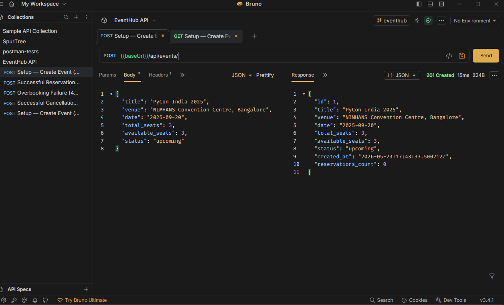
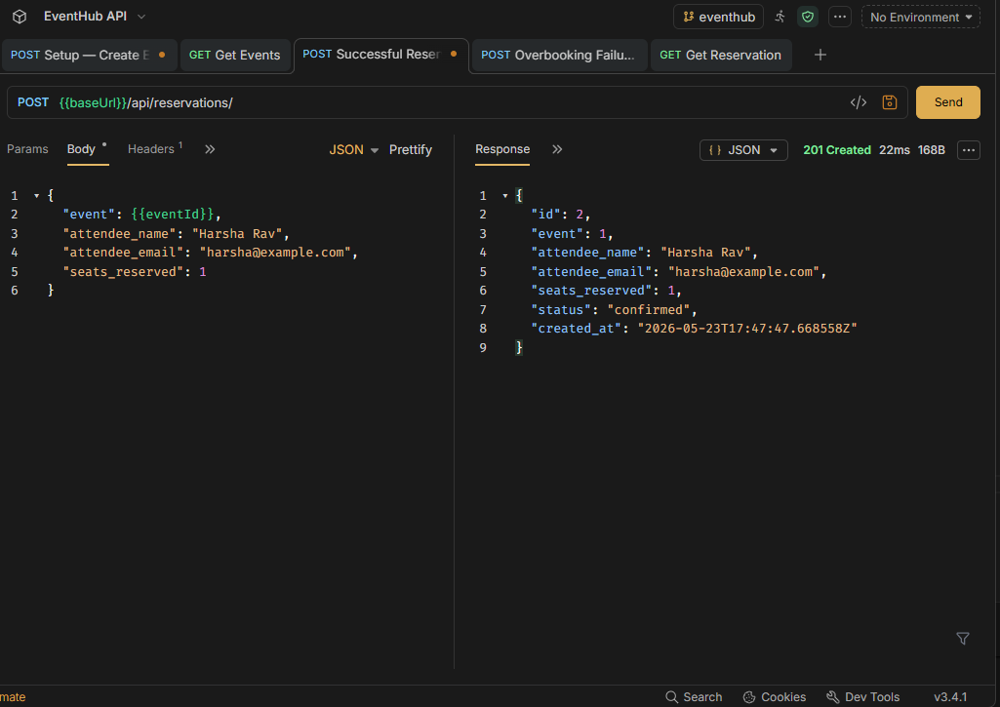
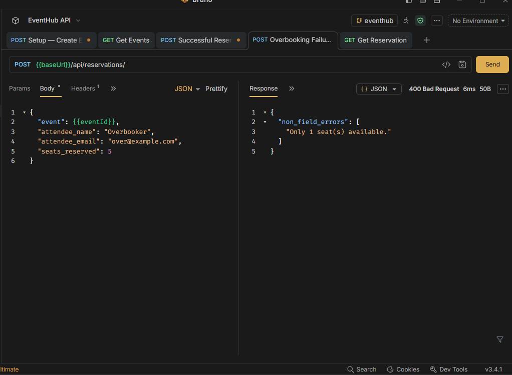
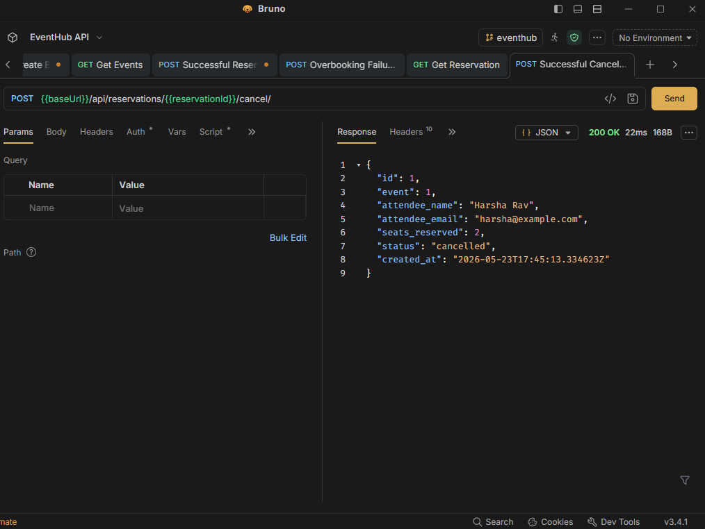

# eventhub

A backend REST API for a simplified event ticketing platform — browse events, reserve seats, and cancel reservations.

## Configuration

Uses Django ORM with SQLite (default). No additional environment variables required.

`rest_framework`, the `events` app, and the `events.middleware.RequestLoggingMiddleware` middleware are wired up in `eventhub/settings.py`.

## Running

From the `eventhub/` directory:

```bash
python manage.py migrate
python manage.py runserver
```

Run migrations before starting the server — this project uses Django ORM and SQLite.

## API Endpoints

### Events

| Method | Path | Description |
|--------|------|-------------|
| GET | `/api/events/` | List all events |
| POST | `/api/events/` | Create an event |
| GET | `/api/events/{id}/` | Retrieve a single event |
| PUT | `/api/events/{id}/` | Update an event |
| DELETE | `/api/events/{id}/` | Delete an event |
| GET | `/api/events/?status=upcoming` | Filter by status (exact match) |
| GET | `/api/events/?venue=mumbai` | Filter by venue (case-insensitive partial) |

Valid `status` values: `upcoming`, `ongoing`, `completed`, `cancelled`

**POST body:**
```json
{
  "title": "PyCon India 2025",
  "venue": "NIMHANS Convention Centre, Bangalore",
  "date": "2025-09-20",
  "total_seats": 500,
  "available_seats": 500,
  "status": "upcoming"
}
```

The response includes a computed `reservations_count` field (count of confirmed reservations).



### Reservations

| Method | Path | Description |
|--------|------|-------------|
| GET | `/api/reservations/` | List all reservations |
| POST | `/api/reservations/` | Create a reservation |
| GET | `/api/reservations/{id}/` | Retrieve a single reservation |
| GET | `/api/reservations/?event_id=1` | Filter by event |
| POST | `/api/reservations/{id}/cancel/` | Cancel a reservation |

**POST body:**
```json
{
  "event": 1,
  "attendee_name": "Priya Sharma",
  "attendee_email": "priya@example.com",
  "seats_reserved": 2
}
```

Reservations are rejected when:
- the event status is not `upcoming` or `ongoing`
- `seats_reserved` exceeds `available_seats` (returns `Only N seat(s) available.`)
- `seats_reserved` is less than 1





Cancelling restores seats back to the event's `available_seats`. Cancelling an already-cancelled reservation returns `400`.



## Design Decisions

### Seat deduction inside `ReservationSerializer.create()`

`available_seats` is decremented on the event and the `Reservation` row is created together inside the serializer's `create()` method, keeping both writes co-located. The validator also re-checks availability before deduction so overbooking is rejected with a `400`.

In a high-concurrency setting both writes should be wrapped in `transaction.atomic()` with `select_for_update()` on the event to fully eliminate the read-modify-write race — left out here intentionally (covered in a later session).

### Request logging middleware

`events.middleware.RequestLoggingMiddleware` logs `method path - status - duration` for every request via the `events.middleware` logger (configured in `settings.LOGGING` to write to the console).