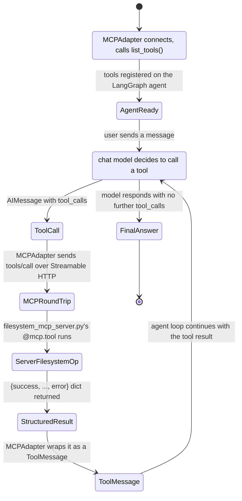

# Workflow: one agent <-> MCP interaction

Every arrow from `ToolCall` through `ToolMessage` is visible live in the REPL
via the existing `Tool call: {name}({args})` / `Tool result (...)` panels --
no bespoke MCP-event plumbing was needed for this.
