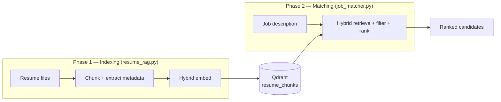
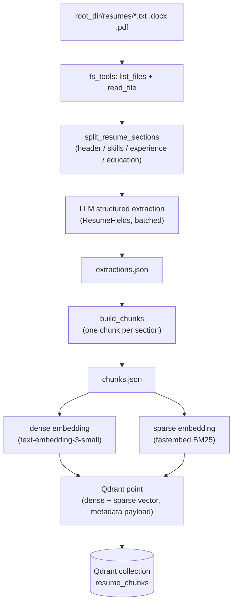
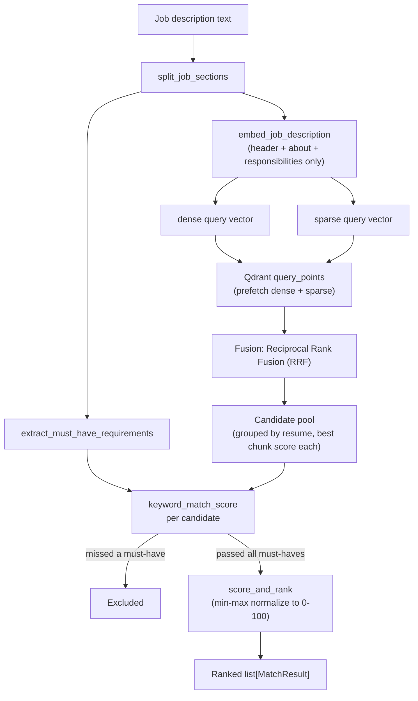

# Design

This project has two phases that run independently:

1. **Indexing** (offline, run once whenever resumes change) — turn raw resume
   files into searchable vectors in Qdrant. Code: `resume_rag.py`.
2. **Matching** (online, run once per job description) — given a job posting,
   retrieve and rank the best-fitting resumes from that same Qdrant
   collection. Code: `job_matcher.py`, evaluated by `metrics.py`.

Both are pure function libraries with no top-level execution — the actual
runs happen cell-by-cell in `rag_analysis.ipynb`.



---

## Phase 1: Ingesting & Indexing Resumes

### 1. Loading

Resumes (`.txt`, `.docx`, `.pdf`) live under `root_dir/resumes/<dept>/`. The
sandboxed `fs_tools.list_files` / `read_file` tools (carried over from the
`llm_file_assistant` project) discover and read them, dispatching text
extraction by file suffix — no new loader code needed for this project.

### 2. Chunking — section-aware, not fixed-size

Every resume follows the same all-caps heading format: `SUMMARY`, `SKILLS`,
`EXPERIENCE`, `EDUCATION`. Instead of splitting text into arbitrary
fixed-size windows (the usual RAG default), `split_resume_sections` splits on
these real section boundaries. Each **section becomes exactly one chunk** —
this keeps semantically-related content (e.g. a whole job's bullet points)
together in one vector, instead of arbitrarily cut mid-thought.

### 3. Metadata extraction — LLM, batched

Four fields need actual reasoning to extract reliably (not regex):
`candidate_name`, `skills` (normalized/deduplicated), `total_experience_years`
(estimated from date ranges), `education_level`. An OpenRouter chat model
with `.with_structured_output(ResumeFields)` extracts all four per resume.
Resumes are processed in batches (`config.EXTRACTION_BATCH_SIZE`), each batch
issuing one concurrent `.batch()` call rather than one request at a time, with
per-item error isolation (`return_exceptions=True`) so one bad resume can't
fail the whole batch.

### 4. Embeddings — hybrid dense + sparse

Every chunk gets **two** vectors, not one:

| | Dense | Sparse |
|---|---|---|
| Model | `openai/text-embedding-3-small` (via OpenRouter) | `fastembed`'s BM25 (`Qdrant/bm25`) |
| Captures | Semantic meaning ("led a team" ≈ "management experience") | Exact keywords ("Kubernetes" only matches "Kubernetes") |
| Shape | 1536 dense floats | A handful of non-zero (token, weight) pairs |

Dense alone can blur past an exact required skill; sparse alone can't
generalize past exact wording. Storing both lets a later query fuse them.

### 5. Vector storage — one Qdrant collection, two named vectors

`resume_chunks` stores one point per chunk:

```
point {
  id: uuid5(file_path + "::" + section)   # deterministic — reruns update, not duplicate
  vector: { "dense": [...], "sparse": {indices, values} }
  payload: {
    page_content: "<chunk text>",
    metadata: { file_path, file_name, dept, candidate_name,
                education_level, total_experience_years, skills, section }
  }
}
```

The sparse vector config uses Qdrant's `Modifier.IDF`, so Qdrant computes
BM25-style inverse-document-frequency weighting server-side — fastembed only
needs to supply raw term frequencies. Payload indexes on
`metadata.dept` / `education_level` / `skills` make future filtered
searches (e.g. "engineering department only") fast instead of a full scan.



---

## Phase 2: Job Matching

### 1. Parsing the job description

Job postings under `root_dir/jobs/` all share 4 headings: `About the role`,
`Responsibilities`, `Must-have requirements`, `Nice-to-have`.
`split_job_sections` slices on these (same technique as resume chunking).
`extract_must_have_requirements` then pulls out the individual bullets,
correctly re-joining any bullet that word-wraps onto a second line.

### 2. Retrieval — hybrid search fused with RRF

Only the descriptive prose (title + "About the role" + "Responsibilities") is
embedded — **not** the must-have bullets, which are handled separately by
exact keyword matching in the next step, not semantic similarity. Both a
dense and a sparse query vector are built from that prose, then Qdrant's
`query_points` runs **both searches at once** and fuses the two ranked lists
with **Reciprocal Rank Fusion (RRF)**: each result's *rank position* in each
list matters, not its raw score — so a chunk ranked highly by *both* signals
rises to the top, without needing the two differently-scaled scores to be
directly comparable.

Because the collection is chunk-level, raw hits are grouped back up to one
row per candidate resume (keeping each candidate's best-scoring chunk).

### 3. Must-have filtering — hard gate, no LLM call

For each candidate still in the pool, `keyword_match_score` checks every
must-have bullet:
- A quantified bullet ("5+ years of X") checks `total_experience_years`
  against the number, plus a keyword match against the candidate's
  normalized skills list when the bullet names a concrete technology.
- An unquantified bullet ("Experience with X") checks keyword overlap only.

**Any candidate missing even one must-have is dropped entirely** — no partial
credit. This is deliberately simple (regex + list lookups, no LLM), fast, and
fully auditable, at the cost of being sensitive to word-form mismatches (see
[Known limitations](#known-limitations) below).

### 4. Scoring & ranking

Survivors' raw RRF scores (small, not naturally 0–100) are min-max
normalized across just that query's survivors, so the best match is always
100 and the weakest surviving match is near 0. A templated (non-LLM)
`reasoning` string names which must-haves and skills drove the result.
`match_job` returns the top-`k` `MatchResult`s.



---

## Key decisions, in one line each

- **Section-aware chunking, not fixed-size** — resumes already have clean,
  consistent boundaries; use them instead of arbitrary character windows.
- **Hybrid dense+sparse, not dense-only** — semantic similarity alone can
  blur past hard, exact requirements; keyword-only can't generalize phrasing.
- **RRF fusion server-side (Qdrant), not hand-rolled** — Qdrant's
  `query_points` already implements this correctly; no reason to reimplement it.
- **Must-have bullets excluded from the embedded query text** — they're
  exact-match requirements, better served by keyword checking than fuzzy
  similarity.
- **Hard filter, not soft penalty, for must-haves** — a candidate missing a
  hard requirement shouldn't appear in results regardless of vibe score.
- **Algorithmic (not LLM) must-have checking** — free, instant, deterministic,
  and easy to debug by printing intermediate values — the right place to
  start before reaching for an LLM call per candidate.
- **Deterministic point IDs (`uuid5`)** — re-running the indexing pipeline
  updates existing points instead of creating duplicates.

## Known limitations

Found by actually running real queries, not theoretical:

- **Generic word leakage across bullets** — a bullet like *"Experience with a
  Python web framework (Django or FastAPI)"* extracts `"python"` as a topic
  token too, so anyone who merely knows Python (no framework at all) can
  still pass it, since token matching doesn't know that word is already
  covered by a separate, distinct bullet.
- **No stemming** — `"enterprise negotiation"` (a candidate's skill) and
  `"negotiating"` (a job's bullet) don't substring-match each other despite
  meaning the same thing — simple substring matching has no concept of word
  forms.

Both are honest tradeoffs of "start with simple, deterministic keyword
matching," not crashes or parsing bugs — see `job_matcher.keyword_match_score`
for the exact heuristic.

## File map

| File | Responsibility |
|---|---|
| `fs_tools.py` | Sandboxed file discovery + text extraction (`.txt`/`.docx`/`.pdf`) |
| `config.py` | Env vars, model names, Qdrant client, batch/concurrency settings |
| `resume_rag.py` | Chunking, metadata extraction, hybrid embedding, Qdrant indexing |
| `job_matcher.py` | JD parsing, hybrid RRF retrieval, must-have filtering, scoring |
| `metrics.py` | Retrieval accuracy (precision/recall@k) and latency measurement |
| `rag_analysis.ipynb` | The actual pipeline run, cell by cell, with inline inspection |
