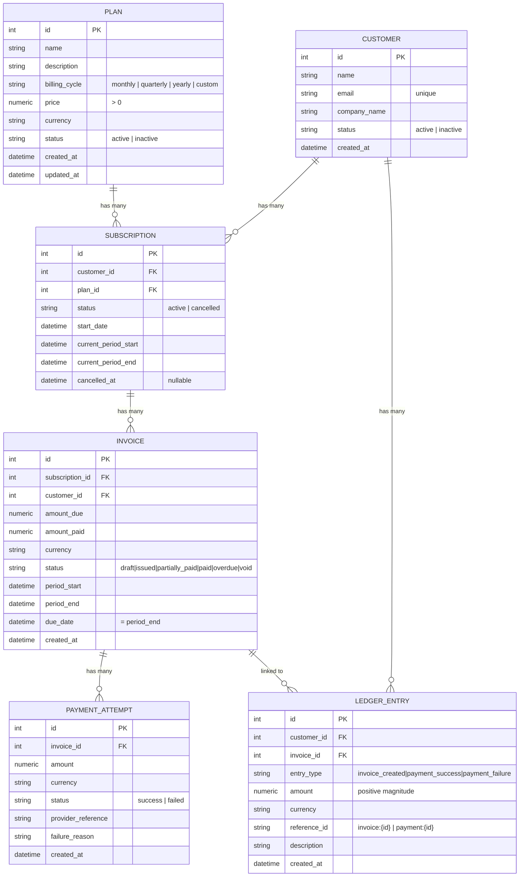
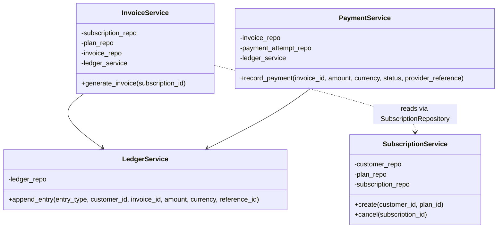

# SubLedger — Low-Level Design

Companion design doc to [rd.md](rd.md). Implementation is Django + Django REST Framework (not the FastAPI/SQLAlchemy hinted in rd.md's skeletons) to match this repo's other projects (see `collab_docs`). Everything below is the Django-adapted, decision-complete version of rd.md §8–§10.

## 0. Locked decisions (resolved ambiguities from rd.md)

These aren't in rd.md explicitly — each was a genuine fork that changes the flows below, so they're called out rather than silently assumed.

| Decision | Resolution |
|---|---|
| App structure | Single Django app `billing` (models/repositories/services/serializers/views all under it) rather than one app per entity — every entity here is tightly FK-chained, so splitting apps would only add migration-ordering pain for no isolation benefit. |
| Auth | Out of scope for this pass (all endpoints `AllowAny`), per rd.md §3. |
| Invoice `due_date` | `due_date = period_end`. Invoice is due by the end of the period it covers. |
| Period advance on invoice generation | Generating an invoice bills the subscription's *current* period, then advances `current_period_start`/`current_period_end` forward by one `billing_cycle`. The subscription always reflects the period it's currently in — no separate renewal job needed. |
| Duplicate invoices | Prevented. `InvoiceService` rejects generation if an invoice already exists for that subscription with the same `period_start`/`period_end`. |
| Cancelling a subscription | Only stops future billing (`status=cancelled`, `cancelled_at=now`). Existing invoices are untouched and keep their own lifecycle — cancelling does not void or forgive outstanding balances. |
| Subscription `status` enum | `active`, `cancelled` only (rd.md doesn't enumerate; no "expired"/"pending" flow exists in the required APIs). |
| Invoice status produced by flows | `generate_invoice` always creates the invoice directly as `issued` (never `draft`). `draft` and `void` remain valid schema states reserved for future/admin use; `overdue` is reserved for a future scheduled job — no current flow sets either. |
| Ledger `amount` sign | Always the positive magnitude of the source event (`invoice_created` copies `invoice.amount_due`; `payment_success`/`payment_failure` copy the payment attempt's `amount`). Direction is implied entirely by `entry_type`, not by sign. |
| Ledger `reference_id` format | `"invoice:{invoice.id}"` for `invoice_created`; `"payment:{payment_attempt.id}"` for `payment_success`/`payment_failure`. Plain string, no polymorphic FK. |
| Payment currency | `PaymentService` rejects a payment attempt whose `currency` doesn't match the invoice's `currency`. Not stated in rd.md, but `amount_paid` tracking is meaningless across currencies without FX conversion, which is explicitly out of scope. |
| FK `on_delete` | `PROTECT` on every cross-entity FK (Subscription→Customer/Plan, Invoice→Subscription/Customer, PaymentAttempt→Invoice, LedgerEntry→Customer/Invoice). No delete endpoints exist anywhere in scope; `PROTECT` just guarantees financial history can never be silently cascaded away if one gets added later. |
| Money precision | `DecimalField(max_digits=12, decimal_places=2)` for every amount/price field. `currency` is `CharField(max_length=3, default="USD")`, unvalidated against ISO-4217 (out of scope). |

## 1. Entity Relationship Diagram

Unchanged from rd.md's ERD — the decisions above affect behavior, not schema.



## 2. Service Responsibility Table

| Service | Owns / Responsibilities | Must NOT Do |
|---|---|---|
| `PlanService` | Create, update, deactivate plans; validate `price > 0`; enforce `billing_cycle` values. | Direct DB queries (goes through `PlanRepository`); touch subscriptions or invoices. |
| `CustomerService` | Create customers; enforce unique email; list/fetch customers. | Manage subscriptions; write invoice logic. |
| `SubscriptionService` | Create/cancel subscriptions; validate plan is active; prevent duplicate active subscriptions (same customer+plan); advance `current_period_*` when told to by `InvoiceService`. | Generate invoices; interact with payment logic. |
| `InvoiceService` | Generate invoices; snapshot `amount_due` from plan price at generation time; compute `period_start`/`period_end`/`due_date`; reject duplicate-period generation; advance the subscription's period; trigger `invoice_created` ledger entry. | Record payments; update `amount_paid` directly. |
| `PaymentService` | Record payment attempts; validate `amount ≤` remaining unpaid balance; validate currency matches invoice; update `amount_paid`/status on success; trigger `payment_success`/`payment_failure` ledger entry. | Generate invoices; modify subscription status. |
| `LedgerService` | Append entries for `invoice_created`, `payment_success`, `payment_failure`; compute `reference_id`. | Modify or delete existing entries; own business-rule validation (it trusts the caller). |

## 3. Repository Responsibility Table

| Repository | Entities Read/Written | Common Methods |
|---|---|---|
| `PlanRepository` | Plan | `create_plan`, `get_plan_by_id`, `list_plans`, `update_plan` |
| `CustomerRepository` | Customer | `create_customer`, `get_by_email`, `get_by_id`, `list_customers` |
| `SubscriptionRepository` | Subscription | `create`, `get_by_id`, `get_active_by_customer_and_plan`, `cancel`, `advance_period`, `list` |
| `InvoiceRepository` | Invoice | `create`, `get_by_id`, `get_by_subscription_and_period`, `update_status`, `update_amount_paid` |
| `PaymentAttemptRepository` | PaymentAttempt | `create`, `get_by_invoice_id` |
| `LedgerRepository` | LedgerEntry | `append_entry`, `get_by_reference_id`, `get_by_customer_id` |

## 4. Business Rule Ownership

| Rule | Where It Lives |
|---|---|
| Plan price > 0 | Plan serializer (schema) + `PlanService` |
| Customer email unique | `CustomerService` + `CustomerRepository` + DB `unique=True` constraint |
| Inactive plan cannot be subscribed to | `SubscriptionService` |
| No duplicate active subscription to same plan | `SubscriptionService` + `SubscriptionRepository` |
| Invoice amount comes from plan price at generation time | `InvoiceService` |
| No duplicate invoice for the same subscription+period | `InvoiceService` + `InvoiceRepository.get_by_subscription_and_period` |
| Invoice generation advances subscription's period | `InvoiceService` (orchestrates) → `SubscriptionRepository.advance_period` |
| Payment cannot exceed unpaid amount | `PaymentService` |
| Payment currency must match invoice currency | `PaymentService` *(assumed rule — not explicit in rd.md, needed for `amount_paid` to be meaningful)* |
| Failed payment does not increase `amount_paid` | `PaymentService` |
| Cancelling a subscription leaves existing invoices untouched | `SubscriptionService` (cancel only touches `Subscription`, never calls into `InvoiceService`) |
| Ledger entries are append-only | `LedgerService` + `LedgerRepository` + `LedgerEntry.save()`/`delete()` override as a hard backstop |

## 5. Design Pattern: Repository Pattern

Same rationale as rd.md §9, adapted to Django ORM instead of raw SQLAlchemy:

```python
# Bad — service writes ORM queries directly
class InvoiceService:
    def generate_invoice(self, subscription_id):
        subscription = Subscription.objects.get(id=subscription_id)

# Good — service delegates to repository
class InvoiceService:
    def __init__(self, subscription_repo, plan_repo, invoice_repo, ledger_service):
        self.subscription_repo = subscription_repo
        self.plan_repo = plan_repo
        self.invoice_repo = invoice_repo
        self.ledger_service = ledger_service

    def generate_invoice(self, subscription_id):
        subscription = self.subscription_repo.get_by_id(subscription_id)
        ...
```

Why: services (`InvoiceService`, `PaymentService`) become unit-testable by injecting fake repositories instead of hitting Postgres; persistence concerns stay out of business logic; and since Django has no built-in `Depends`-style DI, constructor injection of repositories is how each service's dependencies are made explicit and swappable.

## 6. Invoice Generation Flow

1. Route receives `subscription_id` (period is not client-supplied — it's always the subscription's current period).
2. `InvoiceService` fetches the subscription via `SubscriptionRepository`; 404 if missing.
3. Verifies subscription `status == active`.
4. Checks `InvoiceRepository.get_by_subscription_and_period` — if an invoice already exists for `(subscription.current_period_start, subscription.current_period_end)`, reject as a duplicate.
5. Fetches the plan via `PlanRepository` and snapshots `price`/`currency` as `amount_due`/`currency`.
6. Sets `period_start = subscription.current_period_start`, `period_end = subscription.current_period_end`, `due_date = period_end`.
7. `InvoiceRepository.create(...)` with `status="issued"`, `amount_paid=0`.
8. `SubscriptionRepository.advance_period(subscription, billing_cycle)` moves `current_period_start`/`current_period_end` to the next cycle.
9. `LedgerService.append_entry(entry_type="invoice_created", amount=invoice.amount_due, reference_id=f"invoice:{invoice.id}")`.
10. Route returns the invoice.

## 7. Payment Recording Flow

1. Route receives `invoice_id`, `amount`, `currency`, `status`, `provider_reference` (and `failure_reason` if failed).
2. `PaymentService` fetches the invoice via `InvoiceRepository`; 404 if missing.
3. Validates `currency == invoice.currency`.
4. If `status == "success"`: validates `amount <= invoice.amount_due - invoice.amount_paid`; rejects if it would overpay.
5. `PaymentAttemptRepository.create(...)` records the attempt regardless of outcome (success or failed), including `failure_reason` when failed.
6. If **failed**: `amount_paid` is untouched. `LedgerService.append_entry(entry_type="payment_failure", ...)`.
7. If **succeeded**: `InvoiceRepository.update_amount_paid(invoice, invoice.amount_paid + amount)`; new status is `"paid"` if `amount_paid == amount_due` else `"partially_paid"`. `LedgerService.append_entry(entry_type="payment_success", ...)`.
8. Route returns the payment attempt and the invoice's updated status.

## 8. Class Diagram (optional, for orientation)



## 9. Testing Strategy & Workflow Expectations

Companion to `billing/tests/`. Tests exercise the service layer directly (not mocked) against a real, throwaway Postgres database — Django's `TestCase` creates `test_subledger` on the same container dev uses and drops it when the run finishes, so no separate test-DB setup is needed beyond `docker compose up -d`.

### Coverage Map

Every rule in §4's Business Rule Ownership table has at least one test exercising it end-to-end through the owning service.

| # | Workflow | Rule (rd.md §7) | Test |
|---|---|---|---|
| 1 | Create a plan with price ≤ 0 | Plan price must be > 0 | `test_plan_rules.PlanPriceValidationTests` |
| 2 | Create a customer with a duplicate email | Customer email must be unique | `test_customer_rules.CustomerEmailUniquenessTests` |
| 3 | Subscribe to an inactive plan | Inactive plan cannot be subscribed to | `test_subscription_rules.SubscriptionRulesTests.test_subscribing_to_inactive_plan_is_rejected` |
| 4 | Create a second active subscription for the same customer+plan | No duplicate active subscription | `test_subscription_rules.SubscriptionRulesTests.test_second_active_subscription_same_customer_and_plan_is_rejected` |
| 5 | Generate an invoice, then change the plan's price | Invoice `amount_due` comes from the plan price at generation time | `test_invoice_rules.InvoiceAmountSnapshotTests.test_invoice_amount_due_snapshots_plan_price_at_generation_time` |
| 6 | Overpay / pay in full / pay partially | Payment cannot exceed unpaid amount; `paid`/`partially_paid` transitions | `test_payment_rules.PaymentAmountRulesTests` |
| 7 | Fail a payment, then generate+pay again | Failed payment doesn't increase `amount_paid`; ledger is append-only and correctly ordered | `test_ledger_rules.FailedPaymentAndLedgerTests` |

### Sample Workflow — Invoice Amount Snapshot (workflow 5)

This is the rule most likely to be broken by a naive implementation (e.g. one that joins to the live `Plan` row on invoice read instead of snapshotting `amount_due` at generation time), so it's worth spelling out precisely:

```text
Given a plan priced at 100.00 and a customer with an active subscription to it
When  InvoiceService.generate_invoice(subscription_id) is called
Then  the resulting invoice.amount_due == 100.00

Given that invoice already exists
When  PlanService.update_plan(plan_id, price=999.00) is called afterward
Then  invoice.amount_due (re-fetched from the DB) is still 100.00 —
      it must NOT change just because the plan's price changed later.
```

```python
def test_invoice_amount_due_snapshots_plan_price_at_generation_time(self):
    invoice = self.invoice_service.generate_invoice(self.subscription.id)
    self.assertEqual(invoice.amount_due, self.plan.price)

    self.plan_service.update_plan(self.plan.id, price=Decimal("999.00"))

    invoice.refresh_from_db()
    self.assertEqual(invoice.amount_due, self.plan.price)  # unchanged
```

### Sample Workflow — Payment State Machine (workflow 6)

```text
Given an issued invoice with amount_due = 100.00, amount_paid = 0.00
When  a payment of 150.00 (status=success) is recorded
Then  PaymentExceedsBalanceError is raised

When  a payment of 40.00 (status=success) is recorded instead
Then  invoice.status == "partially_paid" and invoice.amount_paid == 40.00

When  a further payment of 60.00 (status=success) is recorded
Then  invoice.status == "paid" and invoice.amount_paid == 100.00
```

### Sample Workflow — Ledger Trail (workflow 7)

```text
Given an issued invoice
When  a failed payment (30.00) is recorded, then a successful payment (100.00)
Then  the customer's ledger, in order, is exactly:
        invoice_created  (amount=100.00, reference_id="invoice:<id>")
        payment_failure  (amount=30.00,  reference_id="payment:<attempt_id>")
        payment_success  (amount=100.00, reference_id="payment:<attempt_id>")
      and none of these rows can later be updated or deleted
      (LedgerEntry.save()/delete() raise ValueError on an already-persisted row).
```

### Running the suite

```bash
python manage.py test billing --verbosity=2
```
