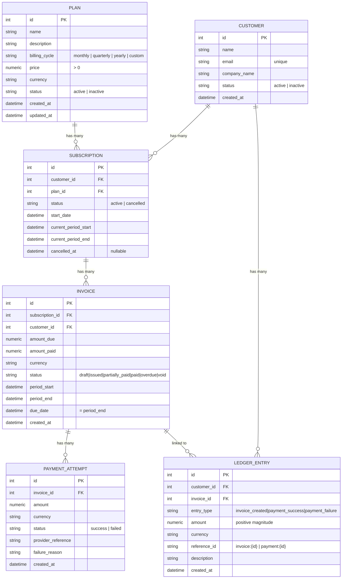

# SubLedger — SaaS Subscription & Billing System

SubLedger is a simplified SaaS subscription & billing backend — plans, customers,
subscriptions, invoices, payments, and an append-only ledger, built as a Django/DRF
Low-Level Design exercise. See [DESIGN.md](DESIGN.md) for the ERD, service/repository
responsibility tables, business-rule ownership, and the invoice/payment flows.

## Project Structure

```
sub_ledger/
├── manage.py
├── docker-compose.yml          # Postgres for local dev
├── .env                        # local secrets — never commit
├── .env.sample                 # safe template to share with the team
├── DESIGN.md                   # LLD: ERD, responsibility tables, flows
├── rd.md                       # original requirements doc
├── sub_ledger/                  # project package
│   ├── settings.py              # all config read from env via python-dotenv
│   ├── urls.py                  # admin, /api/schema/, /api/docs/, includes billing.urls
│   └── wsgi.py / asgi.py
└── billing/                     # the single app — all models/views live here
    ├── models.py                 # Plan, Customer, Subscription, Invoice, PaymentAttempt, LedgerEntry
    ├── repositories/              # one module per entity — all DB reads/writes
    ├── services/                  # one module per entity — business rules and workflows
    ├── serializers.py             # DRF serializers (request/response schemas)
    ├── views/                     # one APIView per endpoint in rd.md §6
    ├── urls.py
    ├── admin.py
    └── tests/                     # business-rule test cases
```

## Data Models

Six models, all in `billing/models.py`. Full ERD, business-rule ownership, and locked
design decisions live in [DESIGN.md](DESIGN.md#1-entity-relationship-diagram); this is
the quick-reference version.



| Model | Purpose | Key fields |
|---|---|---|
| `Plan` | Subscription plan a customer can be signed up for. | `price` (`> 0`, `DecimalField(12,2)`), `billing_cycle`, `currency` (default `USD`), `status` |
| `Customer` | Account being billed. | `email` (unique), `company_name`, `status` |
| `Subscription` | Links a `Customer` to a `Plan`; tracks the current billing period. | `customer` FK, `plan` FK, `status` (`active`/`cancelled`), `current_period_start`/`current_period_end`, `cancelled_at` |
| `Invoice` | A billable charge for one subscription period. | `subscription` FK, `customer` FK, `amount_due`/`amount_paid`, `status`, `period_start`/`period_end`, `due_date` (= `period_end`) |
| `PaymentAttempt` | One try at paying an invoice — recorded whether it succeeds or fails. | `invoice` FK, `amount`, `status` (`success`/`failed`), `failure_reason` |
| `LedgerEntry` | Append-only audit trail of every billing event. | `customer` FK, `invoice` FK, `entry_type`, `amount` (always positive), `reference_id` (`invoice:{id}` / `payment:{id}`) |

**Relationships**

- `Customer` → many `Subscription`, many `LedgerEntry`
- `Plan` → many `Subscription`
- `Subscription` → many `Invoice`
- `Invoice` → many `PaymentAttempt`, many `LedgerEntry`

**Enforced at the model layer**

- Every cross-entity FK uses `on_delete=PROTECT` — financial history can never be silently cascade-deleted.
- `Plan.price` requires `MinValueValidator(0.01)`.
- `Customer.email` is `unique=True`.
- `LedgerEntry.save()`/`delete()` raise `ValueError` on any attempt to update or delete an existing row — the model-level backstop for append-only, on top of the service/repository layer never exposing an update path.

---

## API Endpoints

Full interactive docs (Swagger UI) are served at `/api/docs/` once the server is
running (see [Setup](#setup) below); the raw OpenAPI schema is also checked in at
[schema.yml](schema.yml) (regenerate with `python manage.py spectacular --file schema.yml`).

| Method | Endpoint | Purpose |
|--------|----------|---------|
| POST   | `/api/plans` | Create a subscription plan |
| GET    | `/api/plans` | List plans |
| PATCH  | `/api/plans/{plan_id}` | Update/deactivate a plan |
| POST   | `/api/customers` | Create a customer |
| GET    | `/api/customers` | List customers |
| GET    | `/api/customers/{customer_id}` | Fetch customer details |
| POST   | `/api/subscriptions` | Create a subscription |
| GET    | `/api/subscriptions` | List subscriptions |
| PATCH  | `/api/subscriptions/{subscription_id}/cancel` | Cancel a subscription |
| POST   | `/api/invoices/generate` | Generate an invoice for a subscription |
| GET    | `/api/invoices/{invoice_id}` | Fetch invoice details |
| POST   | `/api/payments/record` | Record a payment attempt |
| GET    | `/api/customers/{customer_id}/ledger` | Fetch a customer's ledger history |

---

## Setup

### Pre-Requisites

- Python 3.12+
- Docker (for Postgres)
- Docker Engine running (because `docker compose` is used to start Postgres)
- PgAdmin (optional, for database management)

### 1. Use the repo's shared virtual environment

This project lives in a monorepo with one shared `uv`-managed venv at the repo root
(see the [root README](../README.md)) — there's no separate `sub_ledger`-specific
virtualenv or `requirements.txt`. From the repo root:

```bash
uv sync
```

Then run all `manage.py` commands below via `uv run` from inside `sub_ledger/`
(e.g. `uv run python manage.py migrate`), or activate the root `.venv` directly:

```bash
# Windows
..\.venv\Scripts\activate

# macOS / Linux
source ../.venv/bin/activate
```

### 2. Dependencies

Already installed by step 1 — `django`, `djangorestframework`, `drf-spectacular`,
`django-filter`, `psycopg[binary]`, `python-dotenv` are all in the shared root
`pyproject.toml`.

### 3. Configure environment variables

Copy the sample file and fill in your values:

```bash
cp .env.sample .env
```

| Variable            | Description                   | Default     |
|---------------------|-------------------------------|-------------|
| `SECRET_KEY`        | Django secret key             | *(required)*|
| `DEBUG`             | Enable debug mode             | `True`      |
| `ALLOWED_HOSTS`     | Comma-separated allowed hosts | *(empty)*   |
| `POSTGRES_USER`     | Postgres username             | *(required)*|
| `POSTGRES_PASSWORD` | Postgres password             | *(required)*|
| `POSTGRES_DB`       | Postgres database name        | *(required)*|
| `POSTGRES_HOST`     | Postgres host                 | `127.0.0.1` |
| `POSTGRES_PORT`     | Postgres port                 | `5432`      |

### 4. Start Postgres with Docker Compose

```bash
docker compose up -d
```

Wait for the healthcheck to pass before running migrations:

```bash
docker compose ps
# postgres should show: Up (healthy)
```

**Stop** (data preserved in the `pgdata` volume):
```bash
docker compose down
```

**Stop and destroy all data:**
```bash
docker compose down -v
```

### 5. Run migrations

```bash
python manage.py migrate
```

### 6. Start the development server

```bash
python manage.py runserver
```

### 7. Open the API docs

```
http://localhost:8000/api/docs/
```

---

## Sample Workflow

A full plan → customer → subscription → invoice → payment → ledger walkthrough with
`curl`, against a locally running server (`python manage.py runserver`, default
`http://localhost:8000`). IDs below assume a fresh database — substitute the ids your
own responses actually return.

### 1. Create a plan

```bash
curl -X POST http://localhost:8000/api/plans \
  -H "Content-Type: application/json" \
  -d '{"name": "Pro Monthly", "billing_cycle": "monthly", "price": "100.00"}'
```
```json
{
  "id": 1, "name": "Pro Monthly", "description": "", "billing_cycle": "monthly",
  "price": "100.00", "currency": "USD", "status": "active",
  "created_at": "...", "updated_at": "..."
}
```

### 2. Create a customer

```bash
curl -X POST http://localhost:8000/api/customers \
  -H "Content-Type: application/json" \
  -d '{"name": "Ada Lovelace", "email": "ada@example.com"}'
```
```json
{
  "id": 1, "name": "Ada Lovelace", "email": "ada@example.com",
  "company_name": "", "status": "active", "created_at": "..."
}
```

### 3. Subscribe the customer to the plan

```bash
curl -X POST http://localhost:8000/api/subscriptions \
  -H "Content-Type: application/json" \
  -d '{"customer_id": 1, "plan_id": 1}'
```
```json
{
  "id": 1, "customer_id": 1, "plan_id": 1, "status": "active",
  "start_date": "...", "current_period_start": "...",
  "current_period_end": "... (+1 month)", "cancelled_at": null
}
```

### 4. Generate an invoice for the subscription

```bash
curl -X POST http://localhost:8000/api/invoices/generate \
  -H "Content-Type: application/json" \
  -d '{"subscription_id": 1}'
```
```json
{
  "id": 1, "subscription_id": 1, "customer_id": 1,
  "amount_due": "100.00", "amount_paid": "0.00", "currency": "USD",
  "status": "issued", "period_start": "...", "period_end": "...",
  "due_date": "...", "created_at": "..."
}
```

This also advances the subscription's `current_period_start`/`current_period_end` to
the next cycle — calling `/invoices/generate` again immediately bills the *new*
period rather than raising a duplicate error; the duplicate check only fires if you
generate twice for the *same* period.

### 5. Record a payment

```bash
curl -X POST http://localhost:8000/api/payments/record \
  -H "Content-Type: application/json" \
  -d '{"invoice_id": 1, "amount": "100.00", "currency": "USD", "status": "success"}'
```
```json
{
  "payment_attempt": {
    "id": 1, "invoice_id": 1, "amount": "100.00", "currency": "USD",
    "status": "success", "provider_reference": "", "failure_reason": "", "created_at": "..."
  },
  "invoice": {
    "id": 1, "subscription_id": 1, "customer_id": 1,
    "amount_due": "100.00", "amount_paid": "100.00", "currency": "USD",
    "status": "paid", "period_start": "...", "period_end": "...",
    "due_date": "...", "created_at": "..."
  }
}
```

A payment above the remaining balance (e.g. `"amount": "1000.00"`) or with a
mismatched `currency` returns `400 Bad Request` instead.

### 6. View the customer's ledger

```bash
curl http://localhost:8000/api/customers/1/ledger
```
```json
[
  {
    "id": 1, "customer_id": 1, "invoice_id": 1, "entry_type": "invoice_created",
    "amount": "100.00", "currency": "USD", "reference_id": "invoice:1",
    "description": "", "created_at": "..."
  },
  {
    "id": 2, "customer_id": 1, "invoice_id": 1, "entry_type": "payment_success",
    "amount": "100.00", "currency": "USD", "reference_id": "payment:1",
    "description": "", "created_at": "..."
  }
]
```

### 7. Cancel the subscription

```bash
curl -X PATCH http://localhost:8000/api/subscriptions/1/cancel
```
```json
{
  "id": 1, "customer_id": 1, "plan_id": 1, "status": "cancelled",
  "start_date": "...", "current_period_start": "...",
  "current_period_end": "...", "cancelled_at": "..."
}
```

Cancelling only stops future billing — the invoice from step 4 keeps its own `paid`
status untouched ([DESIGN.md §0](DESIGN.md#0-locked-decisions-resolved-ambiguities-from-rdmd)).

This exact flow, plus every business-rule rejection along the way, is exercised
automatically in `billing/tests/` — see [Running Tests](#running-tests) below.

---

## Running Tests

The test suite uses Django's test runner, which creates an isolated test database
automatically (still needs `docker compose up -d` running so it can connect to Postgres
to create/drop that test DB).

```bash
# All tests
python manage.py test billing.tests

# Verbose output
python manage.py test billing.tests --verbosity=2
```

Covers the business rules in [DESIGN.md §4](DESIGN.md#4-business-rule-ownership):
plan price validation, unique customer email, inactive-plan subscription rejection,
duplicate active subscription rejection, invoice amount snapshotting, payment
over-payment rejection, and payment/ledger status transitions.
