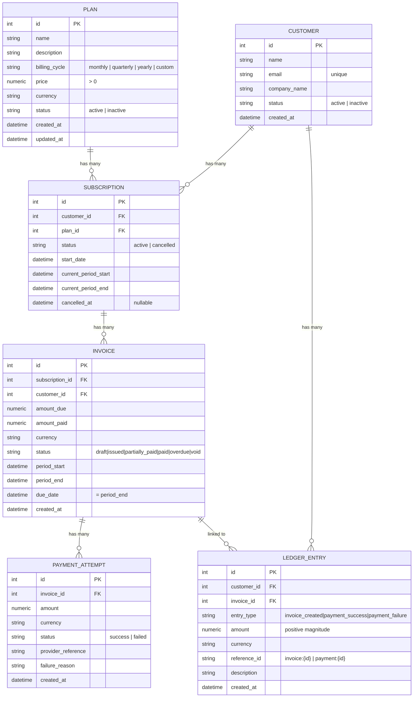

# SubLedger — SaaS Subscription & Billing System

SubLedger is a simplified SaaS subscription & billing backend — plans, customers,
subscriptions, invoices, payments, and an append-only ledger, built as a Django/DRF
Low-Level Design exercise. See [DESIGN.md](DESIGN.md) for the ERD, service/repository
responsibility tables, business-rule ownership, and the invoice/payment flows.

## Project Structure

```
sub_ledger/
├── manage.py
├── docker-compose.yml          # Postgres for local dev
├── .env                        # local secrets — never commit
├── .env.sample                 # safe template to share with the team
├── DESIGN.md                   # LLD: ERD, responsibility tables, flows
├── rd.md                       # original requirements doc
├── sub_ledger/                  # project package
│   ├── settings.py              # all config read from env via python-dotenv
│   ├── urls.py                  # admin, /api/schema/, /api/docs/, includes billing.urls
│   └── wsgi.py / asgi.py
└── billing/                     # the single app — all models/views live here
    ├── models.py                 # Plan, Customer, Subscription, Invoice, PaymentAttempt, LedgerEntry
    ├── repositories/              # one module per entity — all DB reads/writes
    ├── services/                  # one module per entity — business rules and workflows
    ├── serializers.py             # DRF serializers (request/response schemas)
    ├── views/                     # one APIView per endpoint in rd.md §6
    ├── urls.py
    ├── admin.py
    └── tests/                     # business-rule test cases
```

## Data Models

Six models, all in `billing/models.py`. Full ERD, business-rule ownership, and locked
design decisions live in [DESIGN.md](DESIGN.md#1-entity-relationship-diagram); this is
the quick-reference version.



| Model | Purpose | Key fields |
|---|---|---|
| `Plan` | Subscription plan a customer can be signed up for. | `price` (`> 0`, `DecimalField(12,2)`), `billing_cycle`, `currency` (default `USD`), `status` |
| `Customer` | Account being billed. | `email` (unique), `company_name`, `status` |
| `Subscription` | Links a `Customer` to a `Plan`; tracks the current billing period. | `customer` FK, `plan` FK, `status` (`active`/`cancelled`), `current_period_start`/`current_period_end`, `cancelled_at` |
| `Invoice` | A billable charge for one subscription period. | `subscription` FK, `customer` FK, `amount_due`/`amount_paid`, `status`, `period_start`/`period_end`, `due_date` (= `period_end`) |
| `PaymentAttempt` | One try at paying an invoice — recorded whether it succeeds or fails. | `invoice` FK, `amount`, `status` (`success`/`failed`), `failure_reason` |
| `LedgerEntry` | Append-only audit trail of every billing event. | `customer` FK, `invoice` FK, `entry_type`, `amount` (always positive), `reference_id` (`invoice:{id}` / `payment:{id}`) |

**Relationships**

- `Customer` → many `Subscription`, many `LedgerEntry`
- `Plan` → many `Subscription`
- `Subscription` → many `Invoice`
- `Invoice` → many `PaymentAttempt`, many `LedgerEntry`

**Enforced at the model layer**

- Every cross-entity FK uses `on_delete=PROTECT` — financial history can never be silently cascade-deleted.
- `Plan.price` requires `MinValueValidator(0.01)`.
- `Customer.email` is `unique=True`.
- `LedgerEntry.save()`/`delete()` raise `ValueError` on any attempt to update or delete an existing row — the model-level backstop for append-only, on top of the service/repository layer never exposing an update path.

---

## API Endpoints

<!-- TODO -->

---

## Setup

### Pre-Requisites

- Python 3.12+
- Docker (for Postgres)
- Docker Engine running (because `docker compose` is used to start Postgres)
- PgAdmin (optional, for database management)

### 1. Use the repo's shared virtual environment

This project lives in a monorepo with one shared `uv`-managed venv at the repo root
(see the [root README](../README.md)) — there's no separate `sub_ledger`-specific
virtualenv or `requirements.txt`. From the repo root:

```bash
uv sync
```

Then run all `manage.py` commands below via `uv run` from inside `sub_ledger/`
(e.g. `uv run python manage.py migrate`), or activate the root `.venv` directly:

```bash
# Windows
..\.venv\Scripts\activate

# macOS / Linux
source ../.venv/bin/activate
```

### 2. Dependencies

Already installed by step 1 — `django`, `djangorestframework`, `drf-spectacular`,
`django-filter`, `psycopg[binary]`, `python-dotenv` are all in the shared root
`pyproject.toml`.

### 3. Configure environment variables

Copy the sample file and fill in your values:

```bash
cp .env.sample .env
```

| Variable            | Description                   | Default     |
|---------------------|-------------------------------|-------------|
| `SECRET_KEY`        | Django secret key             | *(required)*|
| `DEBUG`             | Enable debug mode             | `True`      |
| `ALLOWED_HOSTS`     | Comma-separated allowed hosts | *(empty)*   |
| `POSTGRES_USER`     | Postgres username             | *(required)*|
| `POSTGRES_PASSWORD` | Postgres password             | *(required)*|
| `POSTGRES_DB`       | Postgres database name        | *(required)*|
| `POSTGRES_HOST`     | Postgres host                 | `127.0.0.1` |
| `POSTGRES_PORT`     | Postgres port                 | `5432`      |

### 4. Start Postgres with Docker Compose

```bash
docker compose up -d
```

Wait for the healthcheck to pass before running migrations:

```bash
docker compose ps
# postgres should show: Up (healthy)
```

**Stop** (data preserved in the `pgdata` volume):
```bash
docker compose down
```

**Stop and destroy all data:**
```bash
docker compose down -v
```

### 5. Run migrations

```bash
python manage.py migrate
```

### 6. Start the development server

```bash
python manage.py runserver
```

### 7. Open the API docs

```
http://localhost:8000/api/docs/
```

---

## Running Tests

The test suite uses Django's test runner, which creates an isolated test database
automatically (still needs `docker compose up -d` running so it can connect to Postgres
to create/drop that test DB).

```bash
# All tests
python manage.py test billing.tests

# Verbose output
python manage.py test billing.tests --verbosity=2
```

Covers the business rules in [DESIGN.md §4](DESIGN.md#4-business-rule-ownership):
plan price validation, unique customer email, inactive-plan subscription rejection,
duplicate active subscription rejection, invoice amount snapshotting, payment
over-payment rejection, and payment/ledger status transitions.
