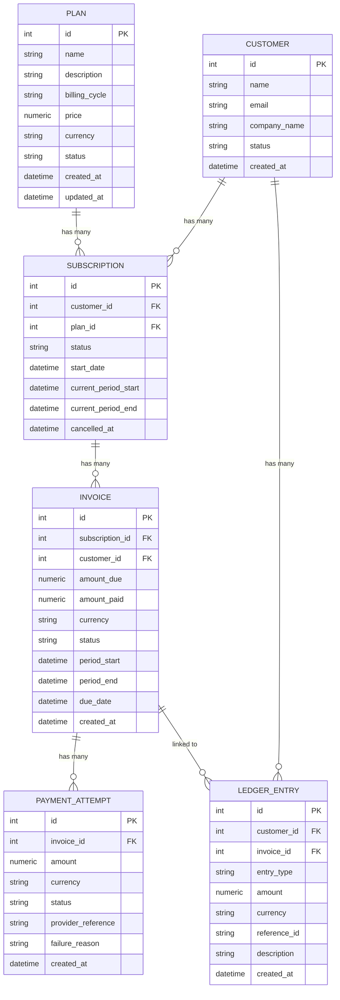

# SubLedger — SaaS Subscription & Billing System

## Assignment Intent

The task is to create the Low-Level Design (LLD) of SubLedger and implement a working backend based on that design. The system should show clear separation between:

- Routes
- Services
- Repositories
- Models
- Schemas
- Configuration
- Database logic

---

## 1. Context

Most SaaS companies need a reliable way to manage plans, customers, subscriptions, invoices, payments, and ledger events. SubLedger is a simplified billing backend. It is **not** a Stripe or Razorpay clone. The goal is to build a clean backend foundation that is easy to understand, test, and extend.

---

## 2. Learning Goals from the Sessions

| Session Concept        | How It Should Show Up                                                                 |
|------------------------|---------------------------------------------------------------------------------------|
| Low-Level Design       | Break the problem into entities, services, repositories, and workflows before coding. |
| SOLID principles       | Keep invoice, subscription, payment, and ledger responsibilities separate.            |
| Repository pattern     | Move database read/write logic into repository classes or modules.                    |
| Service layer          | Keep business workflows inside services, not routes/controllers.                      |
| Dependency management  | Inject DB sessions and dependencies instead of creating everything inline.            |
| Production basics      | Use environment variables, `.env.example`, Docker, and clear run instructions.        |

---

## 3. Product Scope

| In Scope                                                                                                        | Out of Scope                                                                             |
|-----------------------------------------------------------------------------------------------------------------|------------------------------------------------------------------------------------------|
| Plan management; customer management; subscription lifecycle; invoice generation; payment recording; append-only ledger; validation; API docs; local Docker setup. | Real payment gateway integration; frontend UI; complex taxation; proration; authentication/RBAC unless attempted as bonus. |

---

## 4. Domain Model

### Entities & Core Fields

| Entity          | Core Fields                                                                                                         | Notes                                                                 |
|-----------------|---------------------------------------------------------------------------------------------------------------------|-----------------------------------------------------------------------|
| Plan            | id, name, description, billing_cycle, price, currency, status, created_at, updated_at                              | `billing_cycle` can be monthly, quarterly, yearly, or custom if explained. |
| Customer        | id, name, email, company_name, status, created_at                                                                   | Email should be unique.                                               |
| Subscription    | id, customer_id, plan_id, status, start_date, current_period_start, current_period_end, cancelled_at                | Base rule: one active subscription to the same plan per customer.     |
| Invoice         | id, subscription_id, customer_id, amount_due, amount_paid, currency, status, period_start, period_end, due_date, created_at | `status` can be: draft, issued, partially_paid, paid, overdue, void. |
| PaymentAttempt  | id, invoice_id, amount, currency, status, provider_reference, failure_reason, created_at                            | `status` can be: success or failed.                                   |
| LedgerEntry     | id, customer_id, invoice_id, entry_type, amount, currency, reference_id, description, created_at                   | Ledger entries should be append-only.                                 |

### Suggested Relationships

- **Customer** has many `Subscriptions` and many `LedgerEntries`
- **Plan** has many `Subscriptions`
- **Subscription** has many `Invoices`
- **Invoice** has many `PaymentAttempts` and `LedgerEntries`

### Entity Relationship Diagram (ERD)



### Starter Hint: Invoice Model Skeleton

```python
from sqlalchemy import Column, Integer, String, Numeric, DateTime, ForeignKey
from app.db import Base

class Invoice(Base):
    __tablename__ = "invoices"

    id = Column(Integer, primary_key=True, index=True)
    # TODO: Add subscription_id, customer_id, amount_due, amount_paid,
    # currency, status, period_start, period_end, due_date, created_at,
    # and relationships.
```

---

## 5. Functional Requirements

| Module       | Requirement                                                                                                                                                      |
|--------------|------------------------------------------------------------------------------------------------------------------------------------------------------------------|
| Plan         | Create, update, list, and deactivate plans with price, billing cycle, currency, and status.                                                                     |
| Customer     | Create and list customers with unique email and basic company/contact details.                                                                                   |
| Subscription | Create, activate, cancel, and fetch subscriptions while preventing invalid duplicate active subscriptions.                                                       |
| Invoice      | Generate invoices for active subscriptions and track `amount_due`, `amount_paid`, `status`, and billing period.                                                 |
| Payment      | Record successful and failed payment attempts. Successful payments update invoice status; failed payments do not increase `amount_paid`.                         |
| Ledger       | Create append-only ledger entries for `invoice_created`, `payment_success`, and `payment_failure` events.                                                       |

---

## 6. Required APIs

| Method | Endpoint                              | Purpose                              |
|--------|---------------------------------------|--------------------------------------|
| POST   | /plans                                | Create a subscription plan           |
| GET    | /plans                                | List plans                           |
| PATCH  | /plans/{plan_id}                      | Update/deactivate a plan             |
| POST   | /customers                            | Create a customer                    |
| GET    | /customers                            | List customers                       |
| GET    | /customers/{customer_id}              | Fetch customer details               |
| POST   | /subscriptions                        | Create a subscription                |
| GET    | /subscriptions                        | List subscriptions                   |
| PATCH  | /subscriptions/{subscription_id}/cancel | Cancel a subscription              |
| POST   | /invoices/generate                    | Generate invoice for a subscription  |
| GET    | /invoices/{invoice_id}                | Fetch invoice details                |
| POST   | /payments/record                      | Record a payment attempt             |
| GET    | /customers/{customer_id}/ledger       | Fetch customer ledger history        |

---

## 7. Required Business Rules

- Plan price must be **greater than 0**.
- Customer email must be **unique**.
- A subscription **cannot be created** for an inactive plan.
- A customer **cannot have two active subscriptions** to the same plan (in the base version).
- Invoice `amount_due` should come from the **plan price at the time the invoice is generated**.
- A successful payment **cannot exceed the remaining unpaid amount** on the invoice.
- A **fully paid** invoice should move to `paid` status; a **partial payment** should move to `partially_paid` status.
- A **failed payment** should not increase `amount_paid`.
- Ledger entries should be **append-only** and traceable through `reference_id`.

---

## 8. LLD Expectations and Deliverables

| Deliverable                      | Status         | Expected Format                                                                 |
|----------------------------------|----------------|---------------------------------------------------------------------------------|
| Entity Relationship Diagram      | Mandatory      | Diagram image, Mermaid, dbdiagram.io link, or clear markdown schema table.      |
| Service responsibility table     | Mandatory      | Each service, what logic it owns, and what it should **not** do.                |
| Repository responsibility table  | Mandatory      | Each repository, entities it reads/writes, and common methods.                  |
| Business rule ownership          | Mandatory      | Map every business rule to schema/service/repository/model/database constraint. |
| One design pattern used and why  | Mandatory      | Prefer Repository Pattern or Service Layer Pattern.                             |
| Invoice generation flow          | Guided/simple  | Bullets, pseudocode, or diagram. Formal UML not required.                       |
| Payment recording flow           | Guided/simple  | Bullets, pseudocode, or diagram. Formal UML not required.                       |
| Class diagram                    | Optional       | Add only if it helps explain your design.                                       |

---

## 9. Guided Templates

### Service Responsibility Table

| Service             | Owns / Responsibilities                                                                                       | Must NOT Do                                               |
|---------------------|---------------------------------------------------------------------------------------------------------------|-----------------------------------------------------------|
| PlanService         | Create, update, deactivate plans; validate price > 0; enforce billing_cycle values.                           | Direct DB queries; handle subscriptions or invoices.      |
| CustomerService     | Create customers; enforce unique email; list customers.                                                       | Manage subscriptions; write invoice logic.                |
| SubscriptionService | Create/activate/cancel subscriptions; validate plan is active; prevent duplicate active subscriptions.        | Generate invoices; interact with payment logic.           |
| InvoiceService      | Generate invoices; calculate amount_due from plan price; set billing period; trigger ledger on invoice_created. | Record payments; update amount_paid directly.            |
| PaymentService      | Record payment attempts; validate payment ≤ unpaid amount; update invoice status on success; trigger ledger.  | Generate invoices; modify subscription status.            |
| LedgerService       | Append ledger entries for invoice_created, payment_success, payment_failure.                                  | Modify existing entries; own business rule validation.    |

### Repository Responsibility Table

| Repository                 | Entities Read/Written | Common Methods                                                      |
|----------------------------|-----------------------|---------------------------------------------------------------------|
| PlanRepository             | Plan                  | `create_plan`, `get_plan_by_id`, `list_plans`, `update_plan`        |
| CustomerRepository         | Customer              | `create_customer`, `get_by_email`, `get_by_id`, `list_customers`    |
| SubscriptionRepository     | Subscription          | `create`, `get_by_id`, `get_active_by_customer_and_plan`, `cancel`  |
| InvoiceRepository          | Invoice               | `create`, `get_by_id`, `update_status`, `update_amount_paid`        |
| PaymentAttemptRepository   | PaymentAttempt        | `create`, `get_by_invoice_id`                                       |
| LedgerRepository           | LedgerEntry           | `append_entry`, `get_by_reference_id`, `get_by_customer_id`         |

### Business Rule Ownership

| Rule                                          | Where It Should Live                                         |
|-----------------------------------------------|--------------------------------------------------------------|
| Plan price > 0                                | Plan schema + PlanService                                    |
| Customer email unique                         | CustomerService + CustomerRepository / database constraint   |
| Inactive plan cannot be subscribed to         | SubscriptionService                                          |
| No duplicate active subscription to same plan | SubscriptionService + SubscriptionRepository                 |
| Invoice amount comes from plan price          | InvoiceService                                               |
| Payment cannot exceed unpaid amount           | PaymentService                                               |
| Ledger entries are append-only                | LedgerService + LedgerRepository                             |

### Design Pattern: Repository Pattern

**What it is:** The Repository Pattern abstracts all database read/write logic behind a dedicated class or module per entity, so services never write raw SQL or ORM queries directly.

**Why it is used here:**
- Services like `InvoiceService` or `PaymentService` need to be testable in isolation. By depending on a repository interface, tests can swap real DB calls with mocks.
- It enforces single responsibility — a service orchestrates business logic, a repository owns persistence.
- It makes future migrations (e.g., switching from PostgreSQL to another store) localized to the repository layer.

**Example:**
```python
# Bad: service writes ORM logic directly
def generate_invoice(self, subscription_id):
    subscription = db.query(Subscription).filter_by(id=subscription_id).first()

# Good: service delegates to repository
def generate_invoice(self, subscription_id):
    subscription = self.subscription_repo.get_by_id(subscription_id)
```

---

## 10. Core Flows

### Invoice Generation Flow

1. Route receives `subscription_id` and optional billing period.
2. `InvoiceService` fetches subscription through `SubscriptionRepository`.
3. `InvoiceService` verifies subscription exists and is **active**.
4. `InvoiceService` fetches plan details or plan price snapshot.
5. `InvoiceService` calculates `amount_due` and billing period.
6. `InvoiceRepository` creates invoice with `issued` or `draft` status.
7. `LedgerService` creates `invoice_created` ledger entry.
8. Route returns invoice response.

```python
class InvoiceService:
    def __init__(self, subscription_repo, plan_repo, invoice_repo, ledger_service):
        self.subscription_repo = subscription_repo
        self.plan_repo = plan_repo
        self.invoice_repo = invoice_repo
        self.ledger_service = ledger_service

    def generate_invoice(self, subscription_id: int):
        # TODO: fetch subscription, validate it, calculate amount and period,
        # create invoice, create invoice_created ledger entry, return response.
        pass
```

### Payment Recording Flow

1. Route receives `invoice_id`, `amount`, `currency`, `status`, and `provider_reference`.
2. `PaymentService` fetches invoice through `InvoiceRepository`.
3. `PaymentService` validates invoice exists and payment amount is valid.
4. `PaymentAttemptRepository` creates a payment attempt record.
5. If payment **failed**: store failure reason and do **not** increase `amount_paid`.
6. If payment **succeeded**: update `amount_paid` and invoice status.
7. `LedgerService` creates `payment_success` or `payment_failure` ledger entry.
8. Route returns payment attempt and updated invoice status.

```python
class PaymentService:
    def __init__(self, invoice_repo, payment_attempt_repo, ledger_service):
        self.invoice_repo = invoice_repo
        self.payment_attempt_repo = payment_attempt_repo
        self.ledger_service = ledger_service

    def record_payment(self, invoice_id: int, amount, status: str, provider_reference: str):
        # TODO: fetch invoice, validate amount, create payment attempt,
        # update invoice only on success, create ledger entry, return response.
        pass
```

---

## 11. Submission Guidelines

### Required Deliverables

- [ ] **GitHub repository link** with completed implementation.
- [ ] **`README.md`** with:
  - Setup steps
  - API list
  - Assumptions
  - Limitations
- [ ] **`DESIGN.md`** (or README section) containing:
  - ERD
  - Service table
  - Repository table
  - Business-rule ownership
  - Design pattern explanation
  - Invoice generation flow
  - Payment recording flow
- [ ] **At least 5 tests** covering important business rules.
- [ ] **`Dockerfile` and `docker-compose`** or clear local setup commands.
- [ ] *(Optional but recommended)* Swagger documentation or Postman collection.